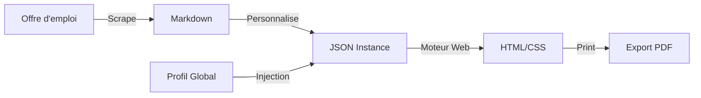

# Resume Builder

Générateur local de candidatures pour transformer des offres brutes en CV et lettres personnalisés.


Ce projet est un moteur de rendu de candidatures (CV et Lettres de Motivation) automatisé et ultra-personnalisé. Il permet de transformer des offres d'emploi brutes en dossiers de candidature haute fidélité en utilisant une approche **"Data-Driven"**.

## Aperçus

| Curriculum Vitae | Lettre de Motivation |
| :---: | :---: |
|  |  |

---

## Architecture du Projet

```text
.
├── data/               # Source de vérité (JSON/Markdown)
├── docs/               # Documentation et guides d'utilisation
├── scripts/            # CLI et tooling Python
├── web/                # Frontend statique
│   ├── resume/         # Moteur de rendu CV
│   └── cover-letter/   # Moteur de rendu lettre
├── shell.nix           # Environnement de développement
└── README.md
```

---

## Fonctionnement

Le workflow est divisé en quatre étapes clés :

1.  **Scrapage** : Récupération automatique des offres d'emploi depuis diverses plateformes.
2.  **Analyse** : Extraction des mots-clés, des compétences requises et des missions principales.
3.  **Personnalisation** : Génération de données JSON spécifiques à chaque offre à partir du profil utilisateur et des exigences du poste (stockées dans `data/instances/`).
4.  **Rendu** : Visualisation dynamique via le moteur web intégré permettant un export PDF parfait.

### Installation

```bash
# Entrer dans l'environnement de développement (si via Nix)
nix-shell

# Lancer le serveur de visualisation
python3 -m http.server 8000
```

---

## Stack Technique

- **Scripts** : Python 3 (scraping, traitement de données, génération).
- **Frontend** : HTML5 moderne, CSS3 (Flexbox/Grid), JavaScript natif (pour l'injection de données).
- **Formatage** : JSON pour les données, Markdown pour les sources d'offres.
- **Environnement** : Nix pour la reproductibilité.

---

## Workflow de Production



---
*Ce projet a été conçu pour industrialiser la recherche d'alternance tout en maintenant une qualité de personnalisation artisanale.*
