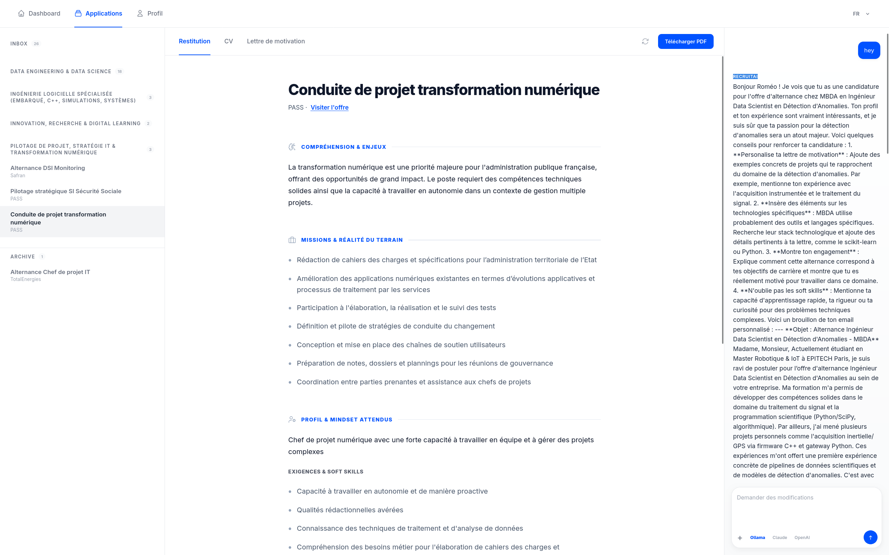
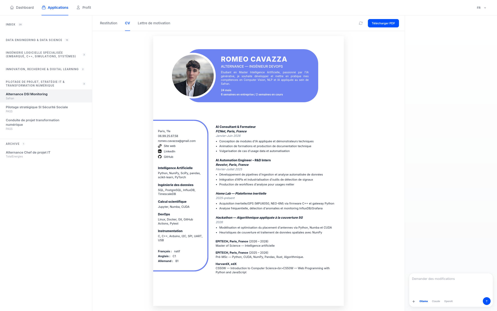
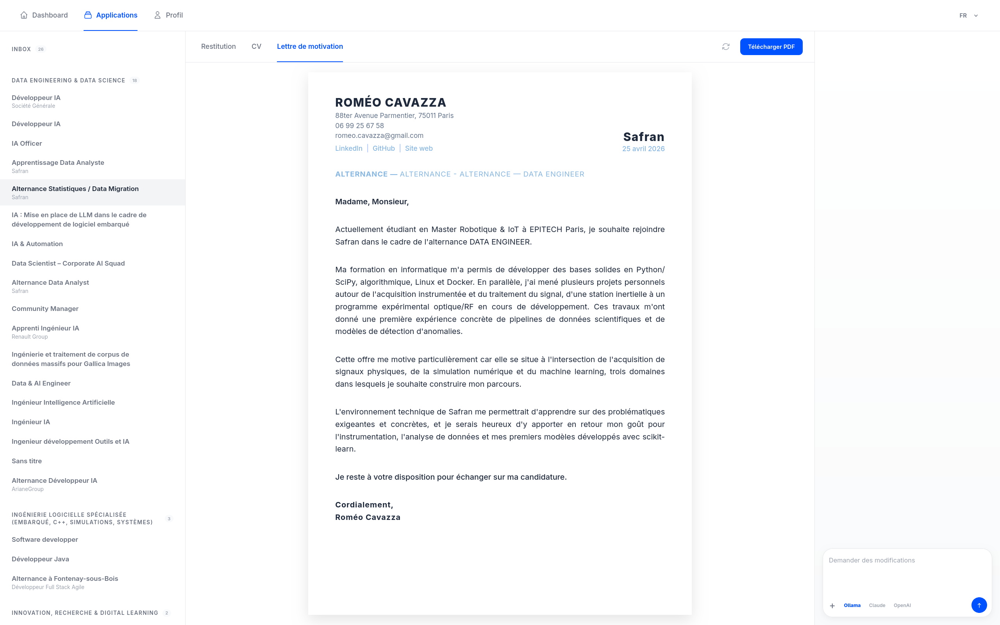
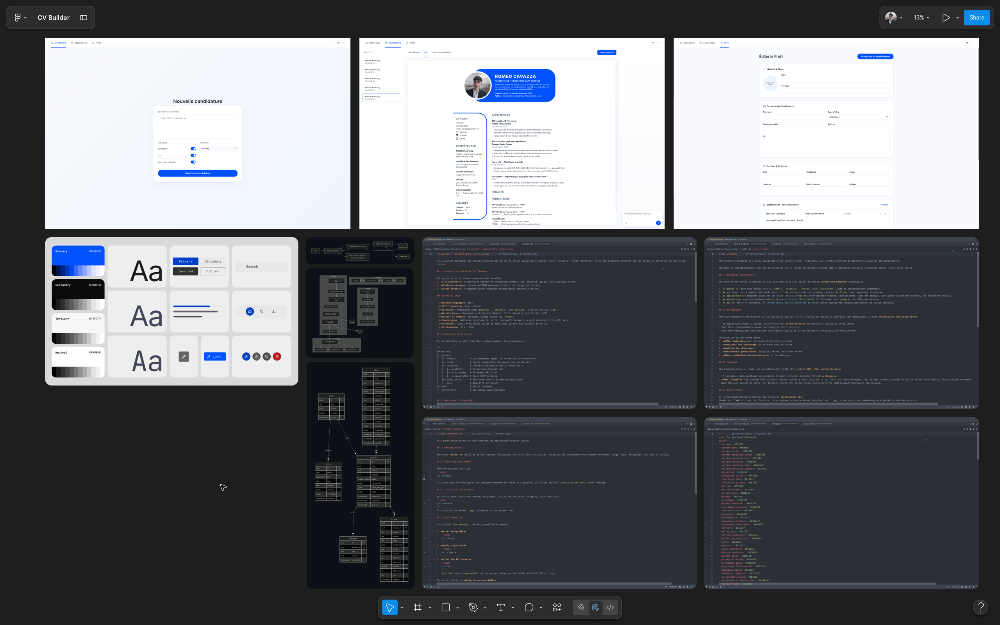
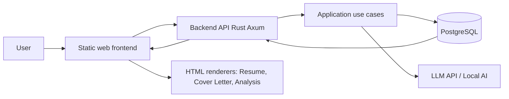
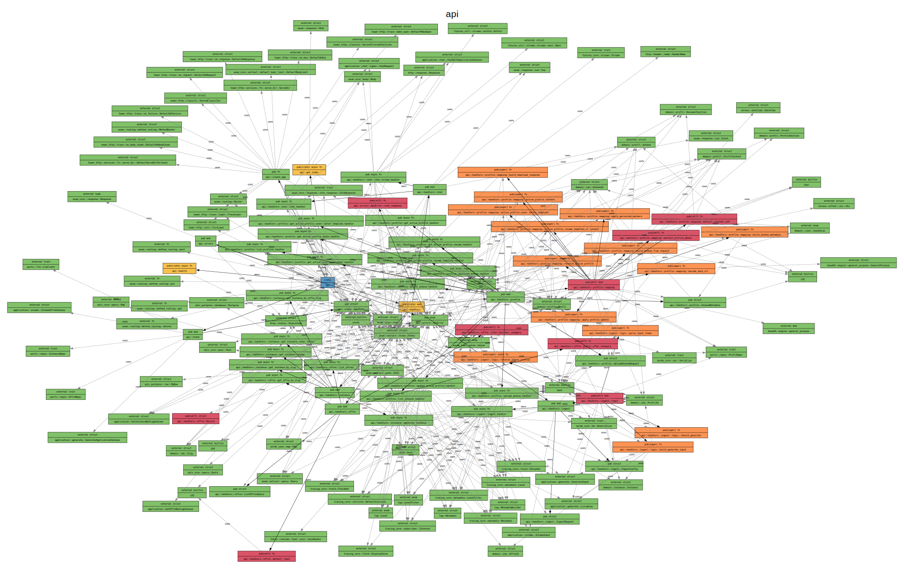
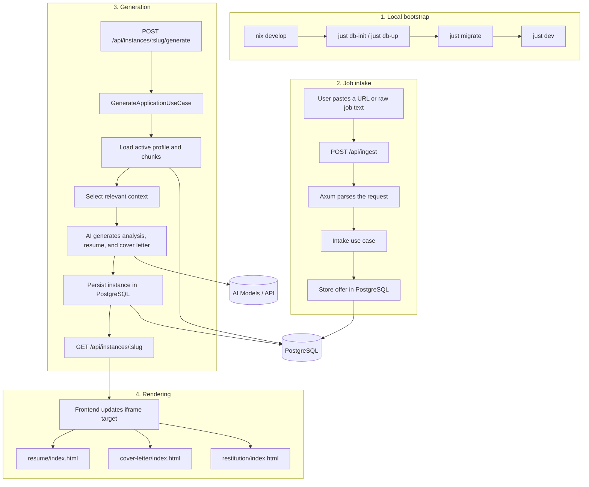

# Resume Builder

Local application builder that turns raw job postings into tailored resumes, structured analyses, and cover letters.


[](https://github.com/RomeoCavazza/open-cv/actions/workflows/backend.yml)
[](https://github.com/RomeoCavazza/open-cv/actions/workflows/frontend.yml)

This project is a local application-generation engine. It ingests job postings, structures them, connects them to a candidate profile stored in the database, and produces high-fidelity deliverables through a Rust + Axum backend, a PostgreSQL database, and structured calls to AI models (Claude, GPT, or local models).

## Previews

### Job Analysis


### Tailored Resume


### Targeted Cover Letter


### Workspace Board


---

## Project Architecture

```text
.
├── crates/             # Rust workspace: domain, ports, application, adapters, api
├── docs/               # Documentation and usage guides
├── migrations/         # SQL schema source of truth (0001_initial.sql)
├── web/                # Static frontend and document renderers
│   ├── resume/         # Resume renderer
│   ├── cover-letter/   # Cover letter renderer
│   ├── restitution/    # Job analysis renderer
│   └── templates/      # JSON rendering fallbacks
├── flake.nix           # Nix development environment
├── Justfile            # Common commands
└── README.md
```

---

## How It Works

The workflow is driven by the Rust backend and can be summarized in five main steps:

1. Ingestion: a job posting is sent to the API, deduplicated, normalized, and stored in offres.
2. Analysis: the posting is structured to extract responsibilities, stack, and key signals.
3. Context selection: the active profile and its chunks are loaded from PostgreSQL.
4. Generation: the application produces a structured analysis, a tailored resume, and a targeted cover letter.
5. Rendering: the static frontend loads the JSON payloads and displays them through printable HTML renderers.
6. Reactive Monitoring: a centralized Master Poller in the parent window monitors generation progress and notifies iframes via storage events, playing an audio alert upon completion.
7. Interaction: a built-in real-time chat (Server-Sent Events) allows refining the documents with instant token streaming.

### Installation

```bash
# Enter the development environment
nix develop

# Initialize local Postgres (first time only)
just db-init

# Start Postgres
just db-up

# Apply migrations
just migrate

# Start the Axum API
just dev
```

The application is then available at http://localhost:8000.

---

## Quality and Performance

The project includes a robust audit and performance suite:

```bash
# Global audit (clippy, deny, fmt, udeps, frontend lint)
just audit

# Performance benchmarking (Criterion.rs)
just bench

# Code coverage report (Tarpaulin)
just coverage

# Architecture visualization
just viz-modules  # Generate modules graph
just viz-deps     # Generate dependency graph
```

## Technical Stack

- Backend: Rust, Axum, Tokio, hexagonal architecture.
- Database: PostgreSQL 16, sqlx, pgvector, pgcrypto, pg_trgm.
- AI: Multi-provider LLM support (Anthropic Claude, OpenAI, Ollama).
- Frontend: native HTML, CSS, and JavaScript, with iframes to isolate document rendering.
- Environment: Nix, Just, Cargo workspace.

---

## System Workflow



---

## Internal Module Architecture



---

## Backend / Frontend Diagram



---

## Documentation

- [docs/README.md](docs/README.md) : Index détaillé de la documentation.
- [docs/blueprint.md](docs/blueprint.md) : Spécifications techniques et roadmap de hardening.
- [docs/toolkit.md](docs/toolkit.md) : Liste des outils et commandes de diagnostic.
- [docs/project_map.md](docs/project_map.md) : Cartographie détaillée de l arborescence et rôle des fichiers.
- [docs/instructions.md](docs/instructions.md) : Setup et commandes courantes.
- [docs/design.md](docs/design.md) : Direction visuelle et principes UI.

---

*This project is built around a local Rust backend to industrialize the application workflow without losing the quality of tailored deliverables.*

---

## Professional TODO

### High Priority (Hardening Phase)
- [ ] **End-to-End Validation**: Verify all generation paths (Dashboard, individual slots, and Re-generate icons).
- [ ] **UI Polish**: Ensure skeleton screens and immediate display are working across all document types.
- [ ] **Scraping Resilience**: Implement ScrapingAnt fallback (403/Cloudflare protection) for 100% ingestion success.
- [ ] **Technical Safety**: Add permanent unit tests for `LlmError::Truncated` and `ParseFailed`.

### UX & Interaction
- [ ] **Enhanced Chat**: Implement "Thinking" UI states and improved streaming token animations.
- [ ] **Context Visibility**: Ensure JSON profile injection is fully accessible to the LLM without context saturation.
- [ ] **System Feedback**: Add success messages for complex background tasks (JSON mutations, deliverable updates).
