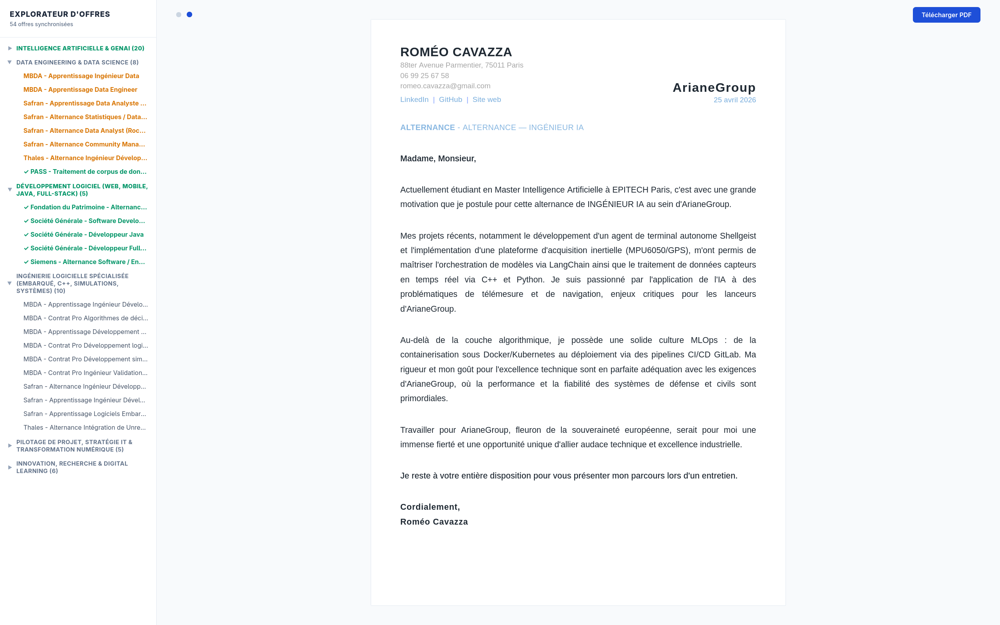
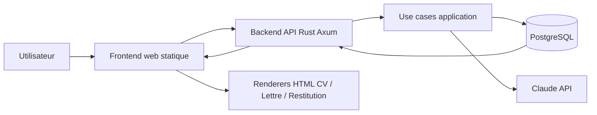
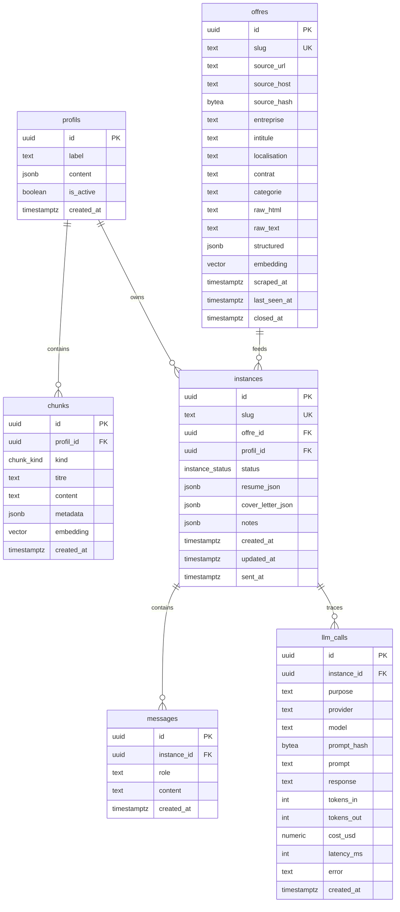

# Resume Builder

Generateur local de candidatures pour transformer des offres brutes en CV, restitutions et lettres personnalises.


Ce projet est un moteur local de generation de candidatures automatisees et ultra-personnalisees. Il prend des offres d'emploi, les structure, les relie a un profil candidat stocke en base, puis genere des livrables haute fidelite via un backend **Rust + Axum**, une base **PostgreSQL**, et des appels structures a **Claude**.

## Apercus

| Curriculum Vitae | Lettre de Motivation |
| :---: | :---: |
|  |  |

---

## Architecture du Projet

```text
.
├── crates/             # Workspace Rust (domain, ports, application, adapters, api)
├── docs/               # Documentation et guides d'utilisation
├── migrations/         # Schema SQL source de verite
├── web/                # Frontend statique et renderers des documents
│   ├── resume/         # Moteur de rendu CV
│   ├── cover-letter/   # Moteur de rendu lettre
│   ├── restitution/    # Moteur de rendu analyse d'offre
│   └── templates/      # Fallbacks JSON pour le rendu
├── flake.nix           # Environnement de developpement Nix
├── Justfile            # Commandes courantes
└── README.md
```

---

## Fonctionnement

Le workflow est maintenant pilote par le backend Rust et se divise grossierement en cinq etapes :

1. **Ingestion** : une offre est envoyee a l'API, dedupliquee, nettoyee et stockee dans `offres`.
2. **Analyse** : l'offre est structuree pour extraire les missions, la stack et les signaux utiles.
3. **Contextualisation** : le profil actif et ses chunks sont recuperes depuis PostgreSQL.
4. **Generation** : l'application produit une restitution, un CV adapte et une lettre ciblee.
5. **Rendu** : le frontend statique charge les JSON et les affiche dans les renderers HTML imprimables.

### Installation

```bash
# Entrer dans l'environnement de developpement
nix develop

# Initialiser Postgres local (premiere fois)
just db-init

# Demarrer Postgres
just db-up

# Appliquer les migrations
just migrate

# Lancer l'API Axum
just dev
```

L'application est ensuite disponible sur `http://localhost:8000`.

---

## Stack Technique

- **Backend** : Rust, Axum, Tokio, architecture hexagonale.
- **Base de donnees** : PostgreSQL 16, `sqlx`, `pgvector`, `pgcrypto`, `pg_trgm`.
- **IA** : client Anthropic Claude pour la generation structuree.
- **Frontend** : HTML, CSS et JavaScript natifs, avec iframes pour isoler les documents.
- **Environnement** : Nix, Just, Cargo workspace.

---

## Workflow de Production



---

## Schema Backend / Frontend

```mermaid
flowchart TD
    subgraph Phase1["1. Boot local"]
        A[nix develop] --> B[just db-init / just db-up]
        B --> C[just migrate]
        C --> D[just dev]
    end

    subgraph Phase2["2. Ingestion d'une offre"]
        E[Utilisateur colle une URL ou une fiche] --> F[POST /api/ingest]
        F --> G[Axum parse la requete]
        G --> H[Use case d'ingestion]
        H --> I[offres en PostgreSQL]
    end

    subgraph Phase3["3. Generation"]
        J[POST /api/instances/:slug/generate] --> K[GenerateApplicationUseCase]
        K --> L[Lecture profil actif + chunks]
        L --> M[Selection du contexte]
        M --> N[Claude genere restitution / resume / cover letter]
        N --> O[instances en PostgreSQL]
        O --> P[GET /api/instances/:slug]
    end

    subgraph Phase4["4. Rendu"]
        Q[Frontend change l'iframe] --> R[/resume/index.html]
        Q --> S[/cover-letter/index.html]
        Q --> T[/restitution/index.html]
        P --> Q
    end

    PG[(PostgreSQL)]
    LLM[(Claude API)]

    I --> PG
    L --> PG
    O --> PG
    N --> LLM
```

---

## Diagramme des Tables



---

## Documentation

- [docs/README.md](docs/README.md) : index de la documentation
- [docs/instructions.md](docs/instructions.md) : demarrage et commandes utiles
- [docs/how_it_works.md](docs/how_it_works.md) : vue d'ensemble technique
- [docs/blueprint.md](docs/blueprint.md) : architecture et pipeline de generation
- [docs/design.md](docs/design.md) : direction visuelle de l'interface

---

*Ce projet a ete repense autour d'un backend Rust local pour industrialiser la recherche d'alternance sans perdre la finesse de personnalisation des candidatures.*
