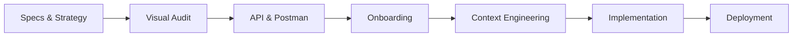
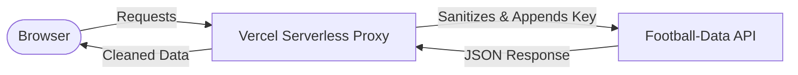

<!-- markdownlint-disable MD033 -->
<div align="center">
  
  <br />
  
  
  
  
</div>
<!-- markdownlint-enable MD033 -->

# Master Course: Dynamic Ligue 1 Dashboard

Welcome to the **complete chronological handbook** for the Ligue 1 Dashboard project. This project is not just a dashboard—it is a live demonstration of the **AI-Assisted Coding** philosophy. It shows how an AI developer (Antigravity) orchestrates the entire lifecycle of a tech product: from market framing and UI audit to fullstack development and industrial deployment.

---

> [!IMPORTANT]
> **MVP Scope Definition**: 
> - Single view experience (no sub-pages).
> - High-density KPIs for instant reading.
> - Dynamic Standings Table with real-time API binding.
> - 4 Key Statistical Visualizations (Bar charts & Histograms).
> - **Zero** complex navigation to maintain speed and focus.

All prompts, strategy and documentation are available in the [**docs**](/docs) folder.

## Technical Core

| Layer | Implementation |
|---|---|
| **Philosophy** |  |
| **Interface** |   |
| **Security** |  |
| **Data Engine** |  |

#### Project Lifecycle: AI-Orchestrated Dashboard Workflow


### The Final Result
The mission: Transform a strategic vision into a live, industrial-grade Ligue 1 Dashboard.

<div align="center">
  
</div>

---

## I. Strategic Framing

Every project begins with a clear **Intention**. We refused "Feature Creep" and defined a strict MVP scope to ensure a premium delivery within record time using our [Strategic Brief](docs/I.%20Strategic%20Framing/Strategy%20and%20Concept.md).

### Step 1.1: Strategy & Vision
All the strategic research was synthesized into a visual framing document that allows the team to align on the final product vision before any code was written — a one-pager summarizing scope, KPIs, and product vision.

> **Excerpt from [Strategy Document](docs/I.%20Strategic%20Framing/Strategy%20and%20Concept.md):**
> *Objective: Develop a production-ready dashboard for French Ligue 1.*
> *Context: Use high-density data visualization to provide immediate KPI insights.*

> **Strategic Prompt (AI Input):**
> *"Act as a Senior Data Engineer. Analyze the Ligue 1 API limits (10 req/min) and design a high-density dashboard that avoids 'Feature Creep'. Prioritize standings and statistical bar charts. The aesthetic must be 'FootX-Dark'—ultra-professional and data-dense."*

> **AI Core Decision (Orchestration):**
> *"I have mapped the MVP to 4 specific endpoints. To respect the Free Tier, I will implement a Server-Side Proxy on Vercel to handle the `X-Auth-Token` securely. Visualizations will be restricted to 4 high-impact charts to maintain single-page focus. Strategy locked."*

---

## II. Visual Audit: The FootX Benchmark

To avoid a "generic" or "empty" feel, we audited **FootX.fr**, a gold standard in professional sports data visualization. We captured 5 key views to teach our AI the specific "Data DNA" of French football.

### Step 2.1: Analyzing the Landing Hierarchy
The landing page audit helps us understand how to greet the user with immediate, high-value information; the screenshot shows the FootX landing page — hierarchy and placement of main KPIs and navigation.
<div align="center">
  
</div>

<br />

| [**Data-Dense Tables (2.2)**](docs/II.%20Graphic%20Collections/references/screenshots_footx/footx_ranking.png) | [**Results & Performance (2.3)**](docs/II.%20Graphic%20Collections/references/screenshots_footx/footx_results.png) |
|---|---|
|  |  |
| [**Match Rhythm (2.4)**](docs/II.%20Graphic%20Collections/references/screenshots_footx/footx_upcoming.png) | [**Analytical Assets (2.5)**](docs/II.%20Graphic%20Collections/references/screenshots_footx/footx_data.png) |
|  |  |

### Engineering the UI Prompt
We didn't just tell the AI to "make it dark." We provided an exhaustive audit prompt to extract specific tokens. 

> **Excerpt from prompt_design.md:**
> *"You are a Senior UI/UX Designer. Audit the provided screenshots of FootX.fr. Extract the following: Primary Background HEX, Surface Card HEX, Border Radius scaled in PX, and Font Stack hierarchy. Output a JSON design system."*

> [!TIP]
> **Mega-Prompt Restoration**: The full design audit prompt is saved in [prompt_design.md](docs/II.%20Graphic%20Collections/prompt_design.md). It instructs the AI to sample HEX codes, border radii, and spacing scales directly from the benchmark images.

### Step 2.6: The AI Design Analysis
The AI processes the benchmark images and outputs a structured set of design rules — prompt and output (colors, radii, typography) derived from the FootX benchmarks (screenshot below).
<div align="center">
  
</div>

### The Final Design System
The result is [theme.md](docs/II.%20Graphic%20Collections/theme.md), which serves as our visual constitution.

> **Excerpt from [theme.md](docs/II.%20Graphic%20Collections/theme.md):**
> *--accent-primary: #DAF42D; /* Neon Lime / Yellow */*
> *--dark-bg: #121212;*
> *Font: 'Outfit', sans-serif;*
> *Border-radius: 12px;*

---

## III. Data Infrastructure & API Validation

The dashboard is "Live-Mocked": it uses real production data from the **football-data.org (v4)** API.

> **Excerpt from [architecture.md](docs/III.%20Architecture%20%26%20API/architecture.md):**
> *Mapping UI components to API collections:*
> *- Standing Table -> /v4/competitions/FL1/standings*
> *- Match History -> /v4/competitions/FL1/matches*
> *- Team Metadata -> /v4/competitions/FL1/teams*

### Step-by-Step API Setup

### Step 3.1: Discovering the Provider
We started by exploring the official provider website to understand the data availability for Ligue 1 (football-data.org branding — official source for the API, see below).
<div align="center">
  
</div>

### Step 3.2: Accessing the API Portal
Navigating to the main developer portal to review the Quickstart guide and integration requirements — API portal landing (screenshot below).
<div align="center">
  
</div>

### Step 3.3: Account Registration
Creating a developer account to obtain a unique `X-Auth-Token` (registration form below).
<div align="center">
  
</div>

### Step 3.4: Reviewing Usage Plans
Auditing the "Free Tier" limitations: the 10 calls/min limit requires a smart caching strategy (pricing and quotas screenshot below).
<div align="center">
  
</div>

### Step 3.5: Accessing the Developer Profile
Verifying the email and unlocking the personal dashboard for key management (developer profile — confirm email and access the key, see below).
<div align="center">
  
</div>

### Step 3.6: Securing the API Key
The final step of the setup is retrieving the `API_KEY` that will be used in our secure proxy — copy the token and store it in Vercel env (never in client code; screenshot below).
<div align="center">
  
</div>

### Step 3.7: Logging Into the Developer Portal
Once registered, you log in to access the documentation and your API key from the same interface (login screen below).
<div align="center">
  
</div>

### Step 3.8: Consulting the API Documentation
The provider offers a clear reference for all endpoints, parameters, and response shapes—essential before writing any integration code (API documentation screenshot below).
<div align="center">
  
</div>

---

## IV. Postman Validation Suite

Before writing a single line of code, we validated every JSON structure. This "Postman First" strategy ensures that our data models are 100% accurate.

### Step-by-Step Validation

### Step 4.1: Locating the Official Collection
We found the official Postman collection provided by the API team to speed up our testing (link or import from the API docs; screenshot below).
<div align="center">
  
</div>

### Step 4.2: Importing the Environment
We imported the collection into our local Postman workspace to begin customization (import step — ready to set variables and run requests; see below).
<div align="center">
  
</div>

### Step 4.3: Configuring Variables
Setting the base URL and authentication headers to enable automated testing across all endpoints (base URL and X-Auth-Token; screenshot below).
<div align="center">
  
</div>

### Step 4.4: Testing Competition Metadata
Verifying that we can correctly retrieve the Ligue 1 name, season, and current matchday (GET competition response below).
<div align="center">
  
</div>

### Step 4.5: Validating Standings & Statistics
Ensuring the "Table" endpoint returns positions, points, and goal differences for all 18 teams (GET standings — full table below).
<div align="center">
  
</div>

### Step 4.6: Auditing Technical Assets
Confirming that team crests (logos) are provided as valid URLs that our frontend can display (GET teams — squad list and crest URLs; screenshot below).
<div align="center">
  
</div>

**Step 4.7: Exporting Production JSON Samples**
We saved the live responses into local JSON files to build a "Static Mock" and enable offline development.

```json
/* Sample from [standings_FL1.json](docs/III.%20Architecture%20%26%20API/postman/samples/standings_FL1.json) */
{
  "competition": { "name": "Ligue 1", "code": "FL1" },
  "season": { "startDate": "2025-08-17", "currentMatchday": 22 },
  "standings": [
    {
      "type": "TOTAL",
      "table": [
        { "position": 1, "team": { "name": "Paris Saint-Germain FC" }, "points": 54 },
        { "position": 2, "team": { "name": "Olympique de Marseille" }, "points": 48 }
      ]
    }
  ]
}
```

Check all exported samples here: [postman/samples/](docs/III.%20Architecture%20%26%20API/postman/samples/)

---

## V. Architecture & Context Engineering

We established a project structure that is "AI-Transparent," providing full clarity to the coding agent while maintaining a decoupled client-proxy model for security.

### Step V.1: Scaffolding Prompts
We provided the AI with two massive logic injections to define the architectural and data-handling rules.

> **Excerpt from [architecture.md](docs/III.%20Architecture%20%26%20API/architecture.md):**
> *"You are a Senior Data Architect. Map the /v4/competitions/FL1/matches endpoint to the MatchCard component. Ensure the 'status' field is parsed to show 'Live' for IN_PLAY matches."*

> [!TIP]
> **Data Logic Scope**: The full data handling logic is defined in [technical_spec.md](docs/IV.%20Context%20Engineering/Contexte/MarkDowns/technical_spec.md).

> **Excerpt from [technical_spec.md](docs/IV.%20Context%20Engineering/Contexte/MarkDowns/technical_spec.md):**
> *"The SPA must handle 10 API calls per minute. Implement an aggressive LocalStorage cache on the /standings endpoint with a 300s TTL."*

<div align="center">
  
</div>

---

### Step V.2: Technical Architecture
The result is a secure request flow that sanitizes tokens and optimizes performance.



This architecture is reflected in a clean, modular file organization:

```text
dashboard/
├── api/             # Vercel Secure Proxy (Node.js)
├── docs/            # Master Knowledge Base
├── public/          # Production UI
│   ├── app.js       # Data Hydration Engine
│   ├── index.html   # Semantic Structure
│   └── style.css    # Sport-Tech CSS System
└── server.js        # Local Dev Node Server
```

---

### Step V.3: Data-to-UI Mapping Blueprint
We mapped every UI block to its respective API collection as defined in our [architecture.md](docs/III.%20Architecture%20%26%20API/architecture.md) — the master plan for the coding session.

<div align="center">
  
</div>

---

## VI. Build Implementation & Vibecoding

Phase VI is where the dashboard is **built and run** during a **vibecoding** session with **Antigravity** (AI coding agent).

---

### 6.1 Vibecoding Session (Phase-by-Phase with Antigravity)

The following sequence documents the **Antigravity** workflow. Each step represents a distinct action in the AI-orchestrated development cycle.

### Step 6.1.1: Strategic Initialization
Creating the project shell and choosing the base template for the Ligue 1 dashboard.
<div align="center">
  
</div>

### Step 6.1.2: Context Injection
Loading the strategy, architecture, and design docs so the agent understands the technical "Contract."
<div align="center">
  
</div>

### Step 6.1.3: Natural Language Prompting
Guiding the agent with a concrete prompt to implement the proxy and feed the data engine.
<div align="center">
  
</div>

### Step 6.1.4: Autonomous Code Output
The agent completes the generation of the three core artifacts (proxy, app logic, and CSS).
<div align="center">
  
</div>

#### **Code Artifact A: Secure API Proxy ([api/proxy.js](api/proxy.js))**  
The secret `API_KEY` lives in environment variables; a Node runtime forwards requests and avoids CORS.
```javascript
export default async function handler(req, res) {
    const { endpoint } = req.query;
    const API_KEY = process.env.API_KEY;
    const response = await fetch(`https://api.football-data.org/v4${endpoint}`, {
        headers: { 'X-Auth-Token': API_KEY }
    });
    const data = await response.json();
    res.status(200).json(data);
}
```

#### **Code Artifact B: Data Engine ([public/app.js](public/app.js))**  
A single entry point fetches standings and matches on load, then fills the dashboard KPIs and charts.
```javascript
async function loadDashboard() {
    const standingsData = await apiFetch('/competitions/FL1/standings');
    const matchesData = await apiFetch('/competitions/FL1/matches?season=2025');
    renderKPIs(standingsData, matchesData);
    renderTable(standingsData);
    renderCharts(standingsData, matchesData);
}
```

#### **Code Artifact C: Design Tokens ([public/style.css](public/style.css))**  
Applied via CSS custom properties to ensure colors and spacing stay consistent with the UI audit.
```css
:root {
  --bg-color: #121212;
  --panel-bg: #1A1A1A;
  --accent-color: #DAF42D; /* Neon Lime */
}
.standings-table {
  width: 100%;
  background: var(--panel-bg);
  border-collapse: collapse;
}
```

### Step 6.1.5: Debugging & Resolution
Handling the "Localhost" connection hand-off to ensure the server is ready for traffic.
<div align="center">
  
</div>

### Step 6.1.6: Local Server Launch
Executing the Node.js backend to start the development environment.
<div align="center">
  
</div>

### Step 6.1.7: Browser Synchronization
Refreshing the preview window to sync the newly written logic with the browser runtime.
<div align="center">
  
</div>

### Step 6.1.8: Final Validated Build
The dashboard is now running locally with real data, fully mapped and styled according to specs.
<div align="center">
  
</div>

---

## VII. Final Delivery & Deployment

The transition from a local development environment to a live, production-grade application is the final milestone of the AI-orchestrated lifecycle.

### 7.1 Software Prerequisites

To sync with GitHub and deploy, you need Git on your machine.

### Step 7.1.1: Software Prerequisite (Git Download)
Download the installer from the official site (download page below).
<div align="center">
  
</div>

### Step 7.1.2: Software Prerequisite (Git Installation)
Follow the wizard to complete the installation on your local system (installer wizard below).
<div align="center">
  
</div>

### 7.2 GitHub: Version Control & Remote Sync

Every milestone is versioned and pushed to the remote source of truth.

**Commands (first push from local):**

```bash
git init
git remote add origin git@github.com:USERNAME/dashboard.git
git add .
git commit -m 'my first commit'
git push -u origin main
```

### Step 7.2.1: Repository Creation
Setting up the destination—initializing a new repository to host the project core.
<div align="center">
  
</div>

### Step 7.2.2: First Sync State
The empty repository state, ready to receive the first commit of the dashboard files.
<div align="center">
  
</div>

### Step 7.2.3: Remote Code Validation
Confirming that all folders (api, docs, public) are correctly synchronized on the server.
<div align="center">
  
</div>

### Step 7.2.4: Sync Continuity
Ensuring the local and remote states are perfectly aligned for industrial deployment.
<div align="center">
  
</div>

---

### 7.3 Vercel: Production Deployment

Transforming the repository into a live, industrial-grade web application.

### Step 7.3.1: Project Import
Connecting the GitHub repository to the Vercel platform to initiate the cloud build.
<div align="center">
  
</div>

### Step 7.3.2: Build Configuration
Defining the framework and directory structure for the serverless deployment.
<div align="center">
  
</div>

### Step 7.3.3: Initial Deployment Trace
Triggering the first build cycle—observing the initial output before environment setup.
<div align="center">
  
</div>

### Step 7.3.4: Environment Variable Setup
Accessing the project settings to inject the required production credentials.
<div align="center">
  
</div>

### Step 7.3.5: Secure API Token Injection
Adding the `X-Auth-Token` as an encrypted variable to the production scope.
<div align="center">
  
</div>

### Step 7.3.6: Industrial Launch
The application is now live and fully operational on its production URL.
<div align="center">
  
</div>

---

##  Mission Accomplished!

Congratulations! Your **Ligue 1 Dashboard** is fully operational and production-ready.

**Live Demo**: [https://dashboard-one-wheat-33.vercel.app/](https://dashboard-one-wheat-33.vercel.app/)

*This master course demonstrates the peak of AI-orchestrated development. From strategy to production, you have successfully navigated the AI-Assisted workflow.*

<div align="center">
  
</div>

