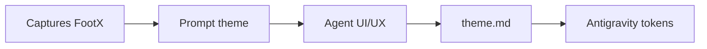

# PROMPT CANONIQUE — theme.md

Ce fichier est le **méga-prompt** pour générer le document **theme.md** (design system) du dashboard Ligue 1. Il impose une analyse des captures FootX et une sortie structurée en tokens, palette, typo et composants.

---

## Workflow recommandé

| Étape | Action |
|-------|--------|
| 1 | Avoir les 5 captures FootX (landing, ranking, results, upcoming, data). |
| 2 | Attacher **projet.md** en annexe. |
| 3 | Copier-coller le bloc ci-dessous. |
| 4 | Vérifier que les HEX sont indiqués comme **estimés** (à valider par pipette). |

---

## Bloc à copier-coller

---

Tu es un expert UI/UX spécialisé en design system pour dashboards data (dark mode).

Ta mission est de produire un document unique nommé theme.md.

Contraintes STRICTES :
- Ne pas parler de business, marketing, roadmap, users.
- Ne pas élargir le scope : uniquement le dashboard mono-page défini dans projet.md (annexe liée).
- Ne proposer aucune autre inspiration que FootX.
- Ne pas inventer des composants / patterns non observables dans FootX.
- Rester orienté implémentation no-code dans Antigravity : recommandations traduisibles en paramètres (couleurs, radius, bordures, spacing, styles texte, composants).
- Les couleurs HEX doivent être présentées comme des estimations issues des captures + du lien (à valider ensuite).

## Contexte projet

On construit un dashboard mono-page Antigravity avec look & feel FootX.
projet.md est une annexe liée (ne pas coller son contenu).

Sources FootX à analyser :
- Lien : https://www.footx.fr/football/leagues/Ligue%201
- 5 captures d'écran :
  1. footx-data.png – page "Value Picks"
  2. footx-landing.png – page "/football/ai-results"
  3. footx-ranking.png – section "classement Ligue 1"
  4. footx-results.png – section "résultats Ligue 1"
  5. footx-upcoming.png – section "matchs à venir"

## Objectif

Produire theme.md, structuré EXACTEMENT avec les sections suivantes :

1. Synthèse visuelle FootX (basée sur les captures + lien)
2. Palette de couleurs (HEX estimés + rôle + fallback)
3. Design tokens (noms de tokens + valeurs) :
   - background
   - surface
   - border
   - accent
   - status (success/danger/warning)
   - text
4. Typographie :
   - échelle (H1/H2/H3/body/caption/number)
   - poids
   - règles de hiérarchie
   - règles d'alignement (tables/KPIs)
5. Layout system :
   - grille (desktop)
   - comportement responsive (mobile)
   - spacing scale
   - marges/gouttières
6. Composants UI (spécifications exploitables Antigravity) :
   - KPI cards
   - Data tables (classement)
   - List items (matchs)
   - Graphiques (bar / donut / histogram)
   - Badges / Status
   - Buttons / Selectors
7. Règles visuelles globales :
   - border radius
   - border style
   - shadow
   - états (hover/selected)
8. Adaptation mono-page (priorités de lisibilité + densité + rythme vertical)
9. Checklist Antigravity (pas à pas : création tokens → styles → composants → QA)

## Format attendu

Markdown
Titre obligatoire : `# theme.md`
Le document doit être directement exploitable.
