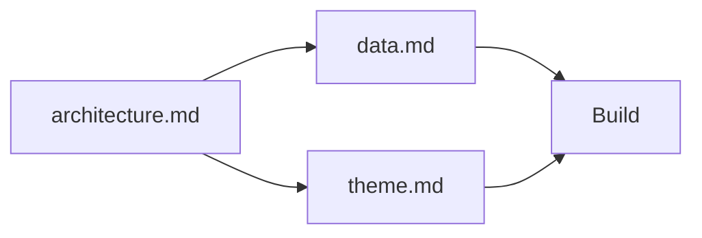

# architecture.md — Architecture Dashboard Ligue 1

Dashboard mono-page Ligue 1 — vue **UI-first**. Ce document est le livrable technique issu du prompt canonique `IV. Context Engineering/Contexte/MarkDowns/architecture.md`. Références : data complète dans `data.md` | Design dans `theme.md`.

---

## Références croisées

| Document | Rôle |
|----------|------|
| **architecture.md** (ce fichier) | Layout, mapping UI → collections, ordre de build. |
| `data.md` | Endpoints, champs, agrégations. |
| `theme.md` | Palette, tokens, composants. |



---

## Layout mono-page (ordre vertical)

```
┌─────────────────────────────────────────────────────┐
│  1. HEADER                                          │
│     Nom compétition · Saison · Logo Ligue 1         │
├─────────────────────────────────────────────────────┤
│  2. KPIs  [Équipes] [Matchs] [Buts] [Moy.] [Journ.] │
├─────────────────────────────────────────────────────┤
│  3. CLASSEMENT                                      │
│     Tableau standings complet                       │
├──────────────────────┬──────────────────────────────┤
│  4a. Bar chart       │  4b. Bar chart               │
│      Top 5 points    │      Meilleures attaques      │
├──────────────────────┼──────────────────────────────┤
│  4c. Bar chart       │  4d. Histogramme             │
│      Meilleures déf. │      Buts par journée         │
├─────────────────────────────────────────────────────┤
│  5. FOOTER  · Données : football-data.org v4        │
└─────────────────────────────────────────────────────┘
```

---

## Mapping UI → Dataset → Collection Antigravity

| # | Bloc UI | Composant Antigravity | Collection | Logique |
|---|---|---|---|---|
| 1 | Header — Nom + Saison | Texte statique / bind | `competition_meta` | Champ nom + saison |
| 1 | Header — Logo | Image (URL bind) | `competition_meta` | Champ `emblem` (URL PNG confirmée) |
| 2 | KPI — Nombre d'équipes | KPI card | `teams_fl1` | `count` |
| 2 | KPI — Matchs joués | KPI card | `matches_fl1` | `count(FINISHED)` |
| 2 | KPI — Total buts | KPI card | `matches_fl1` | `sum(buts)` FINISHED |
| 2 | KPI — Moyenne buts/match | KPI card | `matches_fl1` | `total / count` |
| 2 | KPI — Journée en cours | KPI card | `competition_meta` | Champ matchday |
| 3 | Tableau classement | Table | `standings_fl1` | Toutes lignes, tri position |
| 4a | Bar chart Top 5 points | Bar chart horizontal | `standings_fl1` | `sort DESC points`, top 5 |
| 4b | Bar chart attaques | Bar chart horizontal | `standings_fl1` | `sort DESC goalsFor`, top 5 |
| 4c | Bar chart défenses | Bar chart horizontal | `standings_fl1` | `sort ASC goalsAgainst`, top 5 |
| 4d | Histogramme journée | Histogramme | `matches_fl1` | `group by matchday`, `sum(buts)` |
| 5 | Footer | Texte statique | — | Mention source obligatoire |

---

## Collections à créer dans Antigravity

| Collection | URL | Header |
|---|---|---|
| `competition_meta` | `https://api.football-data.org/v4/competitions/FL1` | `X-Auth-Token: {clé}` |
| `standings_fl1` | `https://api.football-data.org/v4/competitions/FL1/standings` | `X-Auth-Token: {clé}` |
| `matches_fl1` | `https://api.football-data.org/v4/competitions/FL1/matches?season=2025` | `X-Auth-Token: {clé}` |
| `teams_fl1` | `https://api.football-data.org/v4/competitions/FL1/teams` | `X-Auth-Token: {clé}` |

**Règle :** pas de refresh automatique — chargement unique par session.

---

## Colonnes du tableau de classement

Champs confirmés via `standings_FL1.json` réel (saison 2025, journée 22) :

| Colonne affichée | Champ API confirmé | Alignement |
|---|---|---|
| # | `position` | Centre |
| Équipe | `team.name` | Gauche |
| J | `playedGames` | Centre |
| V | `won` | Centre |
| N | `draw` | Centre |
| D | `lost` | Centre |
| BP | `goalsFor` | Centre |
| BC | `goalsAgainst` | Centre |
| Diff | `goalDifference` | Centre |
| Pts | `points` | Centre / **Bold** |

> Accès dans Antigravity : chemin `standings[0].table[]` (tableau imbriqué — type `TOTAL`).

---

## Ordre de build recommandé

```
1. Créer les 4 collections Antigravity + tester la connexion (200 OK)
2. Inspecter la structure réelle des champs dans chaque collection (valider les noms JSON)
3. Construire le Header (bind competition_meta)
4. Construire le tableau Standings (table standings_fl1)
5. Ajouter les 5 KPI cards
6. Ajouter les 3 bar charts (standings_fl1)
7. Ajouter l'histogramme (matches_fl1)
8. Ajouter le Footer (texte statique)
9. Appliquer le thème (palette + tokens → voir theme.md)
10. QA visuel (dark mode, densité, lisibilité)
```
