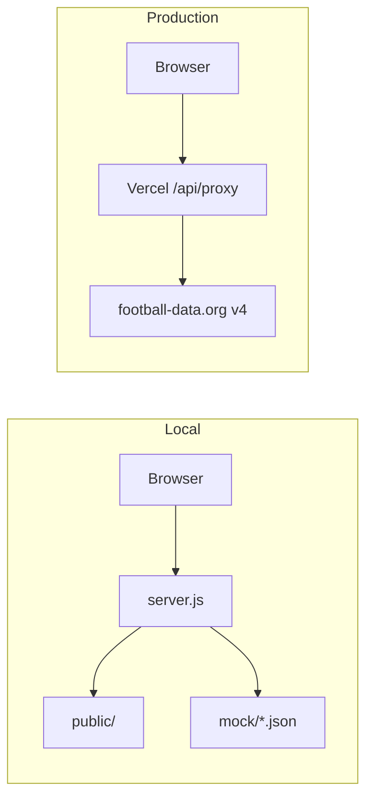

# Arborescence du Projet — Ligue 1 Dashboard

Ce document décrit la structure de fichiers cible du projet. Il sert de **référence unique** pour l’agent de build (Antigravity / vibecoding) et pour les étudiants : toute implémentation doit respecter cette arborescence pour garantir la séparation proxy / frontend / docs.

---

## Objectif pédagogique

- Comprendre la séparation **API proxy** (Vercel serverless) vs **frontend statique** (HTML/CSS/JS).
- Savoir où placer les mocks (JSON) pour le développement local sans consommer le quota API.
- Avoir une checklist de fichiers à créer avant de lancer le build.

---

## Arborescence cible (tree)

```text
dashboard/
├── api/             # Vercel Serverless Functions
│   └── proxy.js     # Proxy API Football-Data
├── docs/            # Documentation & Assets
├── mock/            # Local Mock Data (JSON)
├── public/          # Static Frontend Files
│   ├── app.js       # Dashboard Logic
│   ├── index.html   # Main UI
│   └── style.css    # Modern CSS
├── server.js        # Local Development Server
└── README.md
```

---

## Rôle de chaque dossier

| Dossier / Fichier | Rôle | Utilisé par |
|-------------------|------|-------------|
| `api/` | Fonctions serverless Vercel (proxy sécurisé) | Production : masque `X-Auth-Token`, évite CORS |
| `api/proxy.js` | Handler unique : forward `?endpoint=...` vers football-data.org v4 | Vercel |
| `docs/` | Stratégie, design, architecture, samples Postman | Humains + contexte agent |
| `mock/` | Copies des réponses JSON (competition, standings, matches, teams) | `server.js` en local |
| `public/` | SPA : HTML, CSS, JS du dashboard | Navigateur |
| `public/app.js` | Fetch vers `/api/proxy?endpoint=...`, rendu KPIs, table, charts | Frontend |
| `public/index.html` | Structure sémantique, conteneurs pour les blocs UI | Frontend |
| `public/style.css` | Design tokens (theme.md), grille, composants | Frontend |
| `server.js` | Serveur Express (ou équivalent) pour servir `public/` et `mock/` en local | Dev local |

---

## Flux de données (Mermaid)



---

## Pseudo-code du proxy (`api/proxy.js`)

```javascript
// Vercel serverless: GET /api/proxy?endpoint=/competitions/FL1/standings
export default async function handler(req, res) {
  const endpoint = req.query.endpoint;           // ex: "/competitions/FL1/standings"
  const API_KEY = process.env.API_KEY;           // variable d'environnement Vercel
  const url = `https://api.football-data.org/v4${endpoint}`;
  const response = await fetch(url, {
    headers: { "X-Auth-Token": API_KEY }
  });
  const data = await response.json();
  res.status(200).json(data);
}
```

---

## Checklist avant build

| # | Action | Fichier / Dossier |
|---|--------|-------------------|
| 1 | Créer le dossier `api/` et le fichier `proxy.js` | `api/proxy.js` |
| 2 | Copier les samples Postman dans `mock/` | `mock/competition_FL1.json`, etc. |
| 3 | Créer la structure `public/` avec `index.html`, `style.css`, `app.js` | `public/*` |
| 4 | Configurer `server.js` pour servir `public/` et routes `/mock/*` | `server.js` |
| 5 | Vérifier que `docs/` contient `architecture.md`, `data.md`, `theme.md` | `docs/` |
