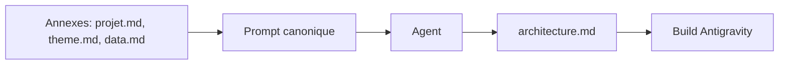

# PROMPT CANONIQUE — architecture.md

Ce fichier est un **méga-prompt** à copier-coller dans une conversation avec un agent (LLM) pour générer le document `architecture.md` du projet Ligue 1 Dashboard. Il définit le rôle, le contexte, les contraintes et la structure de sortie attendue.

---

## Comment utiliser ce prompt

| Étape | Action |
|-------|--------|
| 1 | Ouvrir une nouvelle conversation avec l’agent (Antigravity / Claude / GPT). |
| 2 | Attacher en annexe les fichiers `projet.md`, `theme.md`, `data.md` (contexte). |
| 3 | Copier-coller l’intégralité du bloc ci-dessous (de « Tu es un architecte » à « guide de build »). |
| 4 | Relancer si la sortie ne respecte pas les sections demandées (pas de design, pas de champs inventés). |

---

## Bloc à copier-coller

---

Tu es un architecte no-code senior spécialisé en dashboards data.

Ta mission est de produire un document unique nommé **architecture.md**.

### Contraintes STRICTES

| Contrainte | Explication |
|------------|-------------|
| Périmètre MVP | Travailler uniquement dans le cadre du MVP défini dans **projet.md** (annexe liée). |
| Composants | Ne pas inventer de composants absents d’Antigravity. |
| Scope | Ne pas élargir : pas de pages supplémentaires, pas de fonctionnalités avancées. |
| Design | Ne pas parler de design (c’est dans **theme.md**, annexe liée). |
| Données | Ne pas parler de champs JSON exacts (c’est dans **data.md**, annexe liée). |
| Implémentation | Rester orienté implémentation concrète dans Antigravity. |

### Contexte technique

| Élément | Valeur |
|--------|--------|
| Outil | Antigravity (no-code, datasources REST) |
| Dashboard | Mono-page, Ligue 1 (FL1) |
| API | football-data.org v4 |
| Auth | Header `X-Auth-Token` |

**Collections disponibles :**

| Collection logique | Endpoint |
|--------------------|----------|
| competition_meta | `/v4/competitions/FL1` |
| standings_fl1 | `/v4/competitions/FL1/standings` |
| matches_fl1 | `/v4/competitions/FL1/matches?season=2024` |
| teams_fl1 | `/v4/competitions/FL1/teams` |

### Objectif : structure de sortie

Produire **architecture.md** structuré **EXACTEMENT** avec les sections suivantes :

1. **Layout mono-page**
   - Schéma visuel ASCII de l’ordre des blocs (de haut en bas).
   - Nom de chaque section + rôle.

2. **Mapping UI → Dataset → Collection Antigravity**
   - Tableau : Bloc UI | Composant Antigravity | Collection | Logique de transformation.
   - Une ligne par élément (KPI card = 1 ligne par KPI).

3. **Collections Antigravity**
   - Tableau : Nom | URL complète | Header requis.
   - Règle de refresh (cold start uniquement).

4. **Configuration du tableau de classement**
   - Colonnes affichées.
   - Noms de champs API conventionnels (à valider après test réel).
   - Règles d’alignement.

5. **Ordre de build recommandé**
   - Liste numérotée, du plus simple au plus complexe.
   - 1 étape = 1 action concrète dans Antigravity.

### Contraintes supplémentaires

- Le schéma ASCII doit être lisible sans rendu Markdown.
- Les noms de champs API sont des **conventions à valider** (le mentionner explicitement).
- L’ordre de build doit prioriser : **connexion API → données critiques → KPIs → visualisations → design**.
- Pas de transformations complexes (pas de JOIN, pas de calculs imbriqués).

### Format attendu

- **Format :** Markdown.
- **Titre obligatoire :** `# architecture.md`
- Le document doit être directement utilisable comme **guide de build** dans Antigravity.

---
