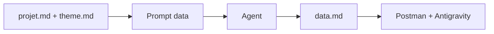

# PROMPT CANONIQUE — data.md

Ce fichier est un **méga-prompt** pour générer le document **data.md** du projet Ligue 1 Dashboard. Il cible l’architecture data et le mapping API → collections → composants, sans inventer de champs JSON.

---

## Usage

| Étape | Action |
|-------|--------|
| 1 | Nouvelle conversation avec l’agent. |
| 2 | Attacher **projet.md**, **theme.md** en annexe (contexte). |
| 3 | Copier-coller le bloc prompt ci-dessous. |
| 4 | Vérifier que la sortie ne contient **aucun** faux JSON ni champs inventés. |



---

## Bloc à copier-coller

---

Tu es un architecte data senior spécialisé en intégration API REST dans des outils no-code.

Ta mission est de produire un document unique nommé **data.md**.

### Contraintes STRICTES

| Contrainte | Détail |
|------------|--------|
| API unique | Utiliser exclusivement l’API **football-data.org v4**. Ne proposer aucune autre API. |
| Pas d’invention | Ne pas inventer de champs JSON, ni d’endpoints. |
| Scope | Ne pas élargir au-delà du MVP défini dans **projet.md** (annexe liée). |
| Pas business | Ne pas parler business. |
| Pas UI | Le design est dans **theme.md** (annexe liée). Travailler uniquement **architecture data + mapping**. |

### Contexte technique

| Élément | Valeur |
|--------|--------|
| **API** | `https://api.football-data.org/v4` |
| **Auth** | Header obligatoire : `X-Auth-Token: {API_KEY}` |
| **Compétition** | FL1 (Ligue 1) |
| **Plan** | Free plan (10 calls/minute). Pas de live data, lineups, ni événements détaillés. |
| **Dashboard** | Mono-page Antigravity (voir projet.md en annexe). |

### Endpoints à analyser

```
GET /v4/competitions/FL1
GET /v4/competitions/FL1/standings
GET /v4/competitions/FL1/matches
GET /v4/competitions/FL1/teams
GET /v4/competitions/FL1/scorers  (optionnel)
```

### Objectif : sections obligatoires de data.md

Le document **data.md** doit contenir **EXACTEMENT** :

| # | Section | Contenu attendu |
|---|---------|-----------------|
| 1 | Vue d’ensemble des endpoints | Rôle fonctionnel de chaque endpoint. |
| 2 | Structure logique des datasets | Groupes logiques **sans inventer les champs**. |
| 3 | Mapping dataset → composants | Tableau : composant dashboard | dataset source | logique. |
| 4 | Agrégations simples | Liste : sum, average, count, tri (compatibles Antigravity). |
| 5 | Optimisation des appels | Stratégie 10 calls/minute (cold start, pas de polling). |
| 6 | Collections Antigravity | Nom logique + rôle de chaque collection. |
| 7 | Flux de chargement | Ordre recommandé des appels (numéroté). |
| 8 | Points de validation | Checklist après inspection réelle des réponses JSON. |
| 9 | Checklist opérationnelle | Setup, inspection, configuration agrégations, validation finale. |

### Contraintes supplémentaires

- Mentionner **explicitement** que la structure exacte des champs sera validée après inspection réelle des réponses JSON.
- **Ne pas** écrire de faux exemples JSON, simuler de payload, ni inventer la structure interne.
- Ne pas proposer de cache serveur externe.
- Rester dans un cadre **no-code Antigravity** uniquement.

### Format attendu

- **Format :** Markdown.
- **Titre obligatoire :** `# data.md`
- Le document doit être **technique, structuré, exploitable immédiatement**.

---
