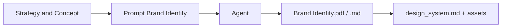

# Prompt — Brand Identity (DRYVIA)

Prompt pour générer le **document d’identité de marque** DRYVIA : nom, palette HEX, vibe, typo, taglines. À utiliser après la stratégie produit et avant le design system et les assets visuels.

---

## Workflow

| Étape | Action |
|-------|--------|
| 1 | Avoir validé la stratégie (niche, USP). |
| 2 | Copier ce prompt (et éventuellement le brief) dans une nouvelle conversation. |
| 3 | Vérifier : nom, palette avec HEX, typo, taglines, résumé exécutif en tableau. |
| 4 | Alimenter branding.md et design_system.md à partir du livrable. |

---

## Bloc prompt (copier-coller)

<Context>
You are an art director and brand strategist for a sport and fitness company. The brand must embody performance, hygiene, innovation, and sustainability.
</Context>

<Role>
Creative Director / Brand Strategist with expertise in sport and tech.
</Role>

<Action>
Create a structured brand identity document spanning maximum 3 pages including:
1. Brand name and strategic rationale.
2. Color palette with hex codes and usage.
3. General vibe and inspirational references.
4. Typography for headlines and body text.
5. Verbal identity: tone, tagline, slogans.
6. Executive summary in table format.
</Action>

<Constraints>
- Brand name: short, memorable, international.
- Premium color palette: dark, technical, with dynamic accents.
- Tone: motivating, clean, scientific.
</Constraints>

<Format>
A fictional 3-page PDF document with titles, tables, bullet points, clearly separated sections.
</Format>

<Tone>
Modern, inspiring, professional, design and user-experience oriented.
</Tone>

<Instructions>
The brand should reflect a blend of indoor sports performance, technical innovation, and ecological commitment. The identity must be premium, clean, and suited for a demanding fitness audience.
</Instructions>