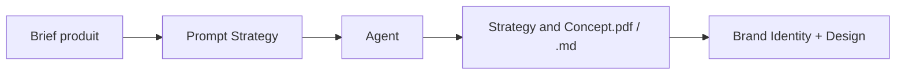

# Prompt — Strategy and Concept (DRYVIA)

Prompt pour générer le **document de stratégie produit** DRYVIA : niche, cible, problème, solution, USP et verdict GO/NO-GO. À utiliser en tout début de projet avant le branding et le design system.

---

## Workflow

| Étape | Action |
|-------|--------|
| 1 | Définir le positionnement (indoor, éco, hygiène, performance). |
| 2 | Copier ce prompt + le brief dans une nouvelle conversation. |
| 3 | Vérifier la structure : niche, cible, problème, solution, tableau USP, verdict. |
| 4 | Exporter en PDF si livrable stratégie demandé. |

---

## Bloc prompt (copier-coller)

<Context>
You are a product strategy expert for a sport and fitness brand. The goal is to define an innovative product niche, with a complete analysis of the market, customer problem, solution, and positioning.
</Context>

<Role>
Senior product strategist specializing in sports equipment and sustainability.
</Role>

<Action>
Write a structured document of maximum 2 pages presenting:
1. A clearly defined product niche.
2. A strategic breakdown including:
   - Target customer
   - Concrete problem
   - Product solution
   - Unique Value Proposition (USP) in table format
   - Business potential
3. A conclusion with a GO/NO-GO verdict.
</Action>

<Constraints>
- Use concrete, technical, yet accessible language.
- Include a simplified marketing positioning as a slogan.
- Avoid unnecessary jargon.
</Constraints>

<Format>
A fictional 2-page PDF document with titles, subtitles, bullet points, and a table.
</Format>

<Tone>
Professional, direct, persuasive, solution-oriented.
</Tone>

<Instructions>
The niche should concern an innovative indoor sports product, eco-responsible, solving a hygiene or comfort problem. The product must be differentiated and have real market potential.
</Instructions>