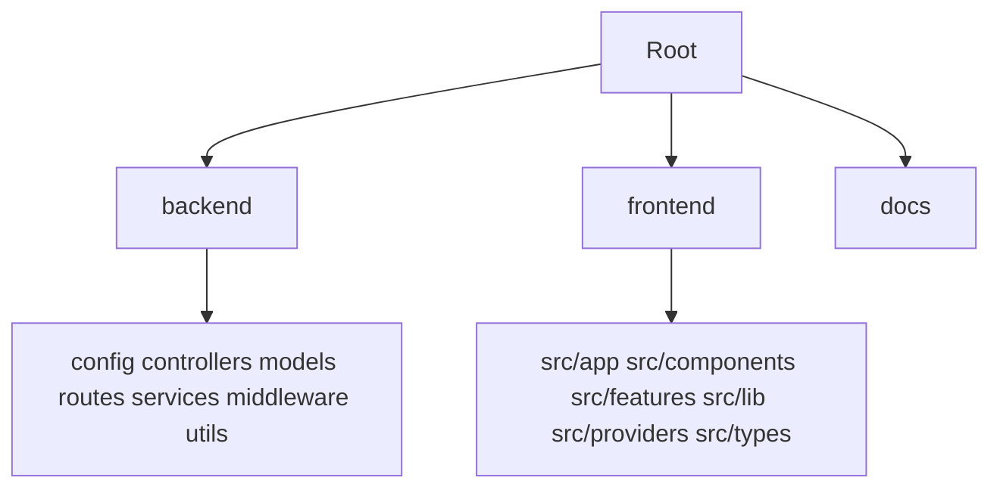

# Arborescence DRYVIA — Scripts de création

Ce document décrit les **scripts de scaffolding** pour générer l’arborescence complète du projet e-commerce DRYVIA (backend Express + frontend Next.js). Il sert de référence pour les étudiants et pour l’agent de vibecoding : exécuter un seul script selon l’OS puis vérifier la structure.

---

## Rôle des dossiers générés

| Dossier | Rôle |
|---------|------|
| `backend/` | API REST Express (TypeScript) : config, controllers, models, routes, services, middleware. |
| `frontend/` | Next.js 14 (App Router) : app, components, features, lib, providers, types. |
| `docs/` | Documentation stratégie, design, prompts (laissé vide par le script). |



---

## Scripts de création

Voici les scripts pour générer automatiquement la structure du projet. Choisissez celui qui correspond à votre système d'exploitation.

## 1. Pour Linux, macOS ou Git Bash (Windows)

Créez un fichier `create_dryvia_structure.sh` avec le contenu suivant :

```bash
#!/bin/bash

# Script pour créer l'arborescence complète du projet DRYVIA e-commerce
# Exécuter avec: bash create_dryvia_structure.sh

set -e  # Arrêter en cas d'erreur

echo " Création de l'arborescence du projet DRYVIA e-commerce..."

# Créer la structure racine (backend, frontend, docs)
mkdir -p backend frontend docs

echo " Dossiers racines créés"

# ==================== BACKEND ====================
echo " Création de la structure backend..."

# Créer les dossiers backend
mkdir -p backend/{config,controllers,middleware,models,routes,services,utils}

# Créer les fichiers backend
touch backend/app.ts
touch backend/config/{db.config.ts,env.config.ts}
touch backend/controllers/product.controller.ts
touch backend/middleware/{auth.middleware.ts,error.middleware.ts}
touch backend/models/{product.model.ts,user.model.ts}
touch backend/package.json
touch backend/routes/{auth.routes.ts,products.routes.ts}
touch backend/server.ts
touch backend/services/product.service.ts
touch backend/tsconfig.json
touch backend/utils/logger.ts

echo "✅ Backend structure créée"

# ==================== DOCS ====================
echo " Création de la structure docs..."
# Le dossier docs est laissé vide pour l'instant
echo "✅ Documentation (vide) créée"

# ==================== FRONTEND ====================
echo " Création de la structure frontend..."

# Créer les dossiers frontend
mkdir -p frontend/public
mkdir -p frontend/src/{app,components/{layout,ui},features/products,lib,providers,types}
mkdir -p frontend/src/app/{cart,shop/[slug]}

# Créer les fichiers de configuration frontend
touch frontend/next.config.ts
touch frontend/next-env.d.ts
touch frontend/package.json
touch frontend/postcss.config.js

echo " Création du dossier public (vide)..."
# Le dossier public est laissé vide pour l'instant

echo "️  Création des fichiers app..."

# Créer les fichiers app
touch frontend/src/app/globals.css
touch frontend/src/app/layout.tsx
touch frontend/src/app/page.tsx
touch frontend/src/app/cart/page.tsx
touch frontend/src/app/shop/page.tsx
touch frontend/src/app/shop/[slug]/page.tsx

echo " Création des composants..."

# Créer les composants
touch frontend/src/components/layout/{Footer.tsx,Header.tsx}
touch frontend/src/components/ProductCard.tsx
touch frontend/src/components/ui/Button.tsx

# Créer les features
touch frontend/src/features/products/{ProductList.tsx,useProducts.ts}

echo " Création des utilitaires..."

# Créer lib, providers, types
touch frontend/src/lib/utils.ts
touch frontend/src/providers/CartProvider.tsx
touch frontend/src/types/index.ts

# Fichiers de configuration supplémentaires
touch frontend/tailwind.config.ts
touch frontend/tsconfig.json

# ==================== FINALISATION ====================
echo "✨ Structure complète créée avec succès !"
echo ""
echo " Résumé de la structure créée :"

# Afficher l'arborescence
echo ""
echo "� Arborescence complète :"
echo ""
# Check if tree is installed, otherwise list
if command -v tree &> /dev/null; then
    tree -L 3 -I 'node_modules|.git'
else
    find . -maxdepth 3 -not -path '*/.*'
fi

echo ""
echo "✅ Projet DRYVIA prêt !"
echo " Pour initialiser git : git init && git add . && git commit -m 'Initial commit'"
```

**Exécution :**
```bash
bash create_dryvia_structure.sh
```

---

## 2. Pour Windows (PowerShell)

Créez un fichier `create_dryvia_structure.ps1` avec le contenu suivant :

```powershell
# Script pour créer l'arborescence complète du projet DRYVIA e-commerce
# Exécuter avec: PowerShell -ExecutionPolicy Bypass -File create_dryvia_structure.ps1

$ErrorActionPreference = 'Stop'

Write-Host "Creation de l'arborescence du projet DRYVIA e-commerce..." -ForegroundColor Cyan

# Définir le dossier racine (le dossier courant)
$root = "."

# Créer la structure racine
New-Item -ItemType Directory -Force -Path "$root/backend", "$root/frontend", "$root/docs" | Out-Null
Write-Host "Structure racine creee" -ForegroundColor Green

# ==================== BACKEND ====================
Write-Host "Creation de la structure backend..." -ForegroundColor Yellow

# Créer les dossiers backend
$backendDirs = @(
    "config", "controllers", "middleware", "models", 
    "routes", "services", "utils"
)
foreach ($dir in $backendDirs) {
    New-Item -ItemType Directory -Force -Path "$root/backend/$dir" | Out-Null
}

# Créer les fichiers backend
$backendFiles = @(
    "app.ts",
    "config/db.config.ts", "config/env.config.ts",
    "controllers/product.controller.ts",
    "middleware/auth.middleware.ts", "middleware/error.middleware.ts",
    "models/product.model.ts", "models/user.model.ts",
    "package.json",
    "routes/auth.routes.ts", "routes/products.routes.ts",
    "server.ts",
    "services/product.service.ts",
    "tsconfig.json",
    "utils/logger.ts"
)
foreach ($file in $backendFiles) {
    New-Item -ItemType File -Force -Path "$root/backend/$file" | Out-Null
}

Write-Host "Backend structure creee" -ForegroundColor Green

# ==================== DOCS ====================
Write-Host "Creation de la structure docs (vide)..." -ForegroundColor Yellow
# Le dossier docs est laissé vide

Write-Host "Documentation (vide) creee" -ForegroundColor Green

# ==================== FRONTEND ====================
Write-Host "Creation de la structure frontend..." -ForegroundColor Yellow

# Créer les dossiers frontend
$frontendDirs = @(
    "public",
    "src/app", "src/components/layout", "src/components/ui",
    "src/features/products", "src/lib", "src/providers", "src/types",
    "src/app/cart", "src/app/shop/[slug]"
)
foreach ($dir in $frontendDirs) {
    New-Item -ItemType Directory -Force -Path "$root/frontend/$dir" | Out-Null
}

# Créer les fichiers de configuration frontend
$frontendConfigFiles = @(
    "next.config.ts", "next-env.d.ts", "package.json", "postcss.config.js",
    "tailwind.config.ts", "tsconfig.json"
)
foreach ($file in $frontendConfigFiles) {
    New-Item -ItemType File -Force -Path "$root/frontend/$file" | Out-Null
}

Write-Host "Creation du dossier public (vide)..." -ForegroundColor Yellow
# Le dossier public est laissé vide

Write-Host "Creation des fichiers app..." -ForegroundColor Yellow

# Créer les fichiers app
$appFiles = @(
    "src/app/globals.css", "src/app/layout.tsx", "src/app/page.tsx",
    "src/app/cart/page.tsx", "src/app/shop/page.tsx", 
    "src/app/shop/[slug]/page.tsx"
)
foreach ($file in $appFiles) {
    New-Item -ItemType File -Force -Path "$root/frontend/$file" | Out-Null
}

Write-Host "Creation des composants..." -ForegroundColor Yellow

# Créer les composants
$componentFiles = @(
    "src/components/layout/Footer.tsx", "src/components/layout/Header.tsx",
    "src/components/ProductCard.tsx", "src/components/ui/Button.tsx",
    "src/features/products/ProductList.tsx", "src/features/products/useProducts.ts"
)
foreach ($file in $componentFiles) {
    New-Item -ItemType File -Force -Path "$root/frontend/$file" | Out-Null
}

Write-Host "Creation des utilitaires..." -ForegroundColor Yellow

# Créer lib, providers, types
$utilFiles = @(
    "src/lib/utils.ts", "src/providers/CartProvider.tsx", "src/types/index.ts"
)
foreach ($file in $utilFiles) {
    New-Item -ItemType File -Force -Path "$root/frontend/$file" | Out-Null
}

# ==================== FINALISATION ====================
Write-Host "Structure complete creee avec succes !" -ForegroundColor Cyan
Write-Host ""
Write-Host "Resume de la structure creee :" -ForegroundColor Cyan

# Afficher l'arborescence
Write-Host ""
Write-Host "Arborescence complete :" -ForegroundColor Cyan
Write-Host ""

if (Get-Command tree -ErrorAction SilentlyContinue) {
    tree /F
} else {
    Get-ChildItem -Recurse | Select-Object FullName
}

Write-Host ""
Write-Host "Projet DRYVIA pret !" -ForegroundColor Green
Write-Host "Pour initialiser git : git init; git add .; git commit -m 'Initial commit'"
```

**Exécution (depuis le dossier contenant le script) :**
```powershell
PowerShell -ExecutionPolicy Bypass -File create_dryvia_structure.ps1
```

---

## Arborescence générée

Voici la structure de fichiers qui sera créée :

```text
.
├── backend/
│   ├── config/
│   │   ├── db.config.ts
│   │   └── env.config.ts
│   ├── controllers/
│   │   └── product.controller.ts
│   ├── middleware/
│   │   ├── auth.middleware.ts
│   │   └── error.middleware.ts
│   ├── models/
│   │   ├── product.model.ts
│   │   └── user.model.ts
│   ├── routes/
│   │   ├── auth.routes.ts
│   │   └── products.routes.ts
│   ├── services/
│   │   └── product.service.ts
│   ├── utils/
│   │   └── logger.ts
│   ├── app.ts
│   ├── package.json
│   ├── server.ts
│   └── tsconfig.json
├── docs/ (vide)
└── frontend/
    ├── public/ (vide)
    ├── src/
    │   ├── app/
    │   │   ├── cart/
    │   │   │   └── page.tsx
    │   │   ├── shop/
    │   │   │   ├── [slug]/
    │   │   │   │   └── page.tsx
    │   │   │   └── page.tsx
    │   │   ├── globals.css
    │   │   ├── layout.tsx
    │   │   └── page.tsx
    │   ├── components/
    │   │   ├── layout/
    │   │   │   ├── Footer.tsx
    │   │   │   └── Header.tsx
    │   │   ├── ui/
    │   │   │   └── Button.tsx
    │   │   └── ProductCard.tsx
    │   ├── features/
    │   │   └── products/
    │   │   │   ├── ProductList.tsx
    │   │   │   └── useProducts.ts
    │   ├── lib/
    │   │   └── utils.ts
    │   ├── providers/
    │   │   └── CartProvider.tsx
    │   └── types/
    │       └── index.ts
    ├── next-env.d.ts
    ├── next.config.ts
    ├── package.json
    ├── postcss.config.js
    ├── tailwind.config.ts
    └── tsconfig.json
```
