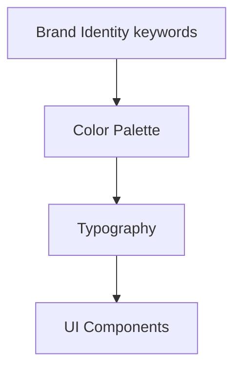

# Design System — DRYVIA

Document **source de vérité** pour les choix visuels du site : couleurs, typographie, composants UI. À respecter dans Tailwind, `globals.css` et tous les composants (boutons, cards, images).

---

## Structure du document

| Section | Usage |
|---------|--------|
| Color Palette | HEX + usage (background, accent, text, borders). |
| Typography | Headings (Montserrat), Body (Inter). |
| UI Components | Buttons (primary/secondary), Cards, Images. |

---

## Brand Identity

- [cite_start]**Vibe:** Nike + Apple Fitness + Modern Ecology[cite: 54].
- [cite_start]**Keywords:** Clean, Technical, Performance, Hygiene[cite: 51].

## Color Palette

The site must use "Dark Mode" aesthetics by default to reflect the premium/gym vibe.

| Name | Hex | Usage |
| :--- | :--- | :--- |
| **Deep Black** | `#0E0E11` | [cite_start]Main Background (Body, Sections) [cite: 52] |
| **Neon Green** | `#00F2A6` | [cite_start]Primary Accent (CTAs, Highlights, Icons) [cite: 52] |
| **Pure White** | `#FFFFFF` | [cite_start]Primary Text, headings [cite: 52] |
| **Steel Gray** | `#8A8F98` | [cite_start]Secondary Text, borders, inactive states [cite: 52] |
| **Fresh Blue** | `#2FD2FF` | [cite_start]Secondary Accent (Cooling features) [cite: 52] |

## Typography

- [cite_start]**Headings:** `Montserrat` [cite: 57](Geometric, Modern, Sporty).
- [cite_start]**Body:** `Inter` [cite: 62](Clean, Readable).

## UI Components

- **Buttons:**
  - *Primary:* Neon Green background (#00F2A6), Black text, rounded corners (full pill or slightly rounded), bold font.
  - *Secondary:* Transparent background, White border, White text.
- **Cards:**
  - Dark gray/black backgrounds with subtle borders (Steel Gray).
  - Hover effects: Slight lift, border glow in Neon Green.
- **Images:**
  - Product images must be clean with no background or contextual gym backgrounds.