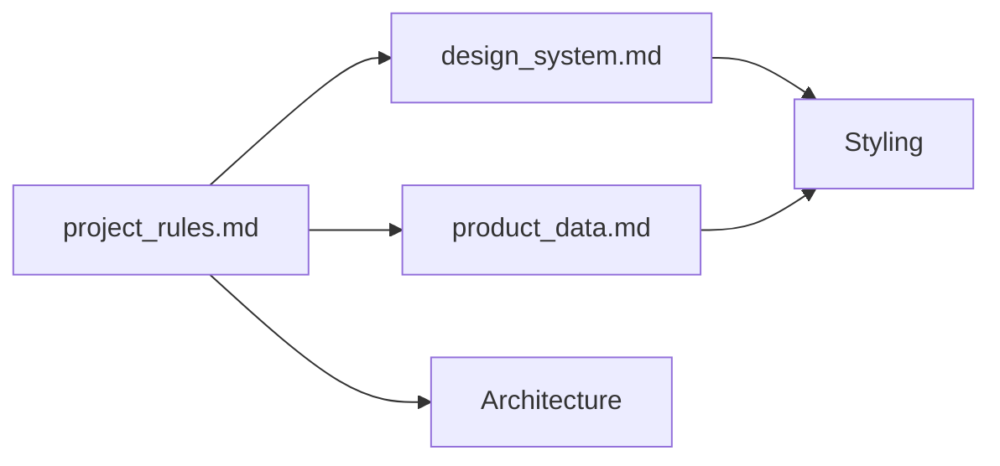

# Project Rules & Context — DRYVIA

Règles **obligatoires** pour tout code généré (frontend et backend). À fournir en annexe aux prompts de vibecoding pour garantir la stack, l’architecture et le workflow.

---

## Références croisées

| Fichier | Quand l’utiliser |
|---------|------------------|
| **project_rules.md** | Définir stack, séparation front/back, workflow. |
| design_system.md | Couleurs, typo, composants UI. |
| product_data.md | Contenu et données produit (pas de placeholder). |

---

## Tech Stack

- **Frontend:** Next.js 16 (App Router), React 19, TypeScript, Tailwind CSS.
- **Backend:** Express.js, TypeScript, Node.js (REST API).
- **Icons:** Lucide React.
- **State:** React Context or Zustand for Cart management.

## Architecture Guidelines

- **Strict Separation:**
  - All frontend code goes into `/frontend`.
  - All backend code goes into `/backend`.
- **Frontend Rules:**
  - Use `src/app` directory structure.
  - Use Server Components by default. Add `'use client'` only when interactivity is needed (hooks, event listeners).
  - Use `next/image` for all images.
  - Ensure the UI is fully responsive (Mobile First).
- **Backend Rules:**
  - Use strict TypeScript types for all models.
  - Follow the controller/service pattern defined in the readme.

## Workflow

- Always refer to `design_system.md` for styling.
- Always refer to `product_data.md` for content and mock data.
- Do not use placeholder text (Lorem Ipsum). Use real content from `product_data.md`.