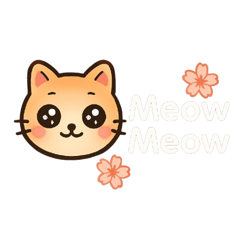
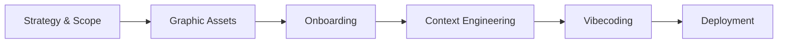
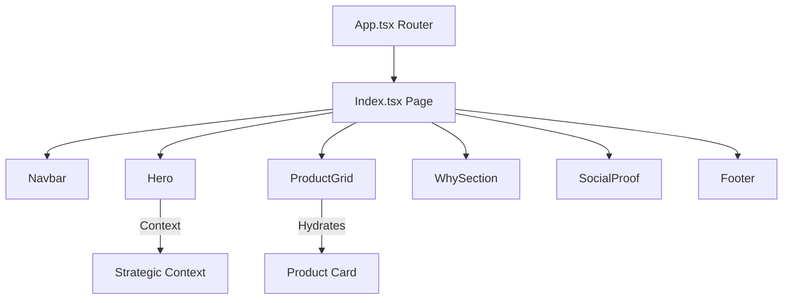

<!-- markdownlint-disable MD033 -->
<div align="center">
  
  <br />
  
  
  
  
</div>
<!-- markdownlint-enable MD033 -->

# Master Course: Meow Meow Aesthetic Landing Page

Welcome to the **complete chronological handbook** for the Meow Meow project. This project is a live demonstration of how an AI coding agent (**Antigravity**) can transform a strategic vision into a premium, design-first DNVB (Digital Native Vertical Brand).

Meow Meow disrupts the pet food market by bridging cat nutrition and interior design—creating the first pet food product beautiful enough to be part of a home's décor.

All prompts, strategy and documentation are available in the [**docs**](/docs) folder.

---

## Technical Core

| Layer | Implementation |
|---|---|
| **Philosophy** |  |
| **Interface** |   |
| **Stack** |    |
| **Deployment** |  |

---

> [!IMPORTANT]
> **MVP Scope Definition**: 
> - Design-first Hero section with instant brand impact.
> - "Instagrammable" product display (Aesthetic Packaging).
> - Persona-driven storytelling for "The Aesthetic Cat Parent".
> - Seamless mobile experience for social media traffic.
> - **Zero** visual clutter to maintain the "Home Decor" feel.


#### Project Lifecycle: AI-Orchestrated DNVB Workflow


### The Final Result
The mission: Transform a strategic vision into a live, industrial-grade Landing Page.

<div align="center">
  
</div>

---
## I. Strategic Framing

Every project begins with a clear **Intention**. Meow Meow isn't just a website; it's a disruption of the pet food market. We refused the "ugly kibble bag" status quo and defined a "Design-first" brand mission using our [Strategic Brief](docs/I.%20Strategic%20Framing/Strategy%20and%20Concept/Strategy%20and%20Concept.md).

### Step 1.1: Defining the Brand Concept
We established the core strategy to position Meow Meow as an "Aesthetic Pet Food" brand, bridging the gap between pet care and premium interior design.

> **Excerpt from Brand Strategy:**
> *Objective: Disrupt the market with 'Aesthetic Pet Food' that doesn't need to be hidden in a cupboard.*
> *Persona: 'The Aesthetic Cat Parent' (Urban dwellers, 25-35, interior design enthusiasts).*
> *USP: 'The first dry food that looks as good as your decoration.'*

<div align="center">
  
</div>

### Step 1.2: Crafting the Brand Identity
Once the concept was locked, we defined the visual DNA: a balance of "Kawaii-Minimalist" and "High-End" aesthetics to create a warm, premium feel.

> **Excerpt from Brand Identity:**
> *Colors: Creamy Latte (#FDFCF0), Soft Rose (#F8D7DA), Terracotta (#E07A5F).*
> *Typography: M PLUS Rounded 1c (Friendly) & Inter (Clean).*
> *Vibe: Warm, Rounded, Soft, and Breathing.*

<div align="center">
  
</div>

### Step 1.3: Strategic Synthesis Deliverable
All strategic research—from persona mapping to visual DNA—was synthesized into a master blueprint that aligned the brand vision before any code was written.

<div align="center">
  
</div>

---

## II. Graphic Collections & AI Orchestration

To avoid a "generic" or "empty" feel, we orchestrated a complete set of branded assets using AI models. Every visual—from the hero banner to the packaging textures—was generated following the "Aesthetic Pet Food" strategy.

### Step 2.1: The Prompting Workflow
We didn't just ask for "cat food." We provided exhaustive brand guardrails to the AI to ensure every pixel matches the Japandi/Pastel DNA.

<div align="center">
  
</div>

### Step 2.2: Branded Asset Gallery
Every image in this project is a direct output of clinical AI prompting. Click on any thumbnail below to view the **Mega-Prompt** used to generate it.

<div align="center">

| [**Hero Banner**](docs/II.%20Graphic%20Collections/Prompts/Prompt%20%E2%80%94%20hero-banner.md) | [**Lifestyle Cosy**](docs/II.%20Graphic%20Collections/Prompts/Prompt%20%E2%80%94%20lifestyle-cosy.md) | [**Macro Texture**](docs/II.%20Graphic%20Collections/Prompts/Prompt%20%E2%80%94%20macro-croquettes.md) | [**Packaging Main**](docs/II.%20Graphic%20Collections/Prompts/Prompt%20%E2%80%94%20packaging-front.md) |
|---|---|---|---|
|  |  |  |  |
| [**Salmon Flavor**](docs/II.%20Graphic%20Collections/Prompts/Prompt%20%E2%80%94%20packaging-saumon.md) | [**Vitamins Mix**](docs/II.%20Graphic%20Collections/Prompts/Prompt%20%E2%80%94%20packaging-vitamines.md) | [**Social Proof I**](docs/II.%20Graphic%20Collections/Prompts/Prompt%20%E2%80%94%20social-proof-chat-dormant.md) | [**Social Proof II**](docs/II.%20Graphic%20Collections/Prompts/Prompt%20%E2%80%94%20social-proof-selfie.md) |
|  |  |  |  |

</div>

### Step 2.3: Final Graphic Deliverable
The culmination of this phase is a comprehensive visual library ready to be injected into the frontend environment.

<div align="center">
  
</div>

---

## III. Onboarding & Context Engineering

Moving from strategic design to technical execution requires a precise "Onboarding" phase. We used **Lovable** as our primary orchestration environment to bridge the gap between AI generation and production-ready code.

### Step 3.1: Platform Onboarding
We initialized the project environment, ensuring all initial scaffolding correctly reflects the premium DNVB requirements.

<div align="center">
  
  
</div>

### Step 3.2: Context Engineering
AI is only as good as the context it consumes. After creating the account, we performed a thorough **Context Engineering** phase: loading our system prompts, architectures, the [Brand DNA Prompt](<docs/IV. Context Engineering/Prompt - Context Engineering.md>), and all our AI-generated graphic assets.

<div align="center">
  
</div>

### Step 3.3: Design System Calibration
Before writing a single line of component logic, we used Lovable's preconfiguration to set the foundation. We manually calibrated the theme to match our established HEX codes and typography.

---

<div align="center">
  
</div>

<div align="center">

| **Custom Colors** | **Graphic Effects** | **Typography** |
|---|---|---|
|  |  |  |

</div>

---

## IV. Vibecoding & Build

With the context fully engineered and the tokens calibrated, we launched the **Vibecoding** execution. This phase is characterized by a high-speed dialogue with the LLM, refining components and layouts in real-time.

> **Strategic Orchestration Prompt (AI Input):**
> *"Act as a Senior Frontend Specialist. Implement a high-end, design-first Landing Page for 'Meow Meow'. Use React with Vite and Tailwind CSS. Prioritize a 'Kawaii-Minimalist' aesthetic with soft pastel tones. Every component must be atomized and use Framer Motion for premium micro-animations."*

---

### Step 4.1: Structural Scaffolding
The agent generates the clean, atomic project tree, maintaining a strict separation between pages, components, and global styles.

```text
landing-page/
├── docs/            # Strategic Foundations
├── frontend/        # Technical Application
│   ├── src/         # React Components & Pages
│   ├── public/      # Static Visual Assets
│   ├── vite.config.ts
│   └── package.json
├── README.md
└── package.json     # Monorepo Workspace
```

---

### Step 4.2: Component Hierarchy & Logic Flow
The landing page relies on a modular hierarchy where the mapping of strategic assets occurs at the component level.



---

### Step 4.3: High-Speed Execution
We provided the orchestration logic to Lovable, which began generating the React components, Tailwind styles, and Framer Motion micro-animations.

<div align="center">
  
</div>

#### **Code Artifact A: Semantic Routing ([frontend/src/App.tsx](frontend/src/App.tsx))**
A clean, centralized router handling the primary landing view and fail-safe 404 handling.
```tsx
const App = () => (
  <QueryClientProvider client={queryClient}>
    <TooltipProvider>
      <BrowserRouter>
        <Routes>
          <Route path="/" element={<Index />} />
          <Route path="*" element={<NotFound />} />
        </Routes>
      </BrowserRouter>
    </TooltipProvider>
  </QueryClientProvider>
);
```

#### **Code Artifact B: Page Orchestration ([frontend/src/pages/Index.tsx](frontend/src/pages/Index.tsx))**
The master assembly file that stitches together the atomic components into a seamless brand experience.
```tsx
const Index = () => {
  return (
    <div className="min-h-screen bg-background">
      <Navbar />
      <main>
        <Hero />
        <ProductGrid />
        <WhySection />
        <SocialProof />
      </main>
      <Footer />
    </div>
  );
};
```

---

## V. Deployment & Monitoring

A premium landing page is only valuable if it is live and performing. We leveraged Lovable's versatile deployment capabilities to move from "Build" to "Production" in seconds.

### Step 5.1: Instant Publishing
For rapid prototyping, we used the one-click publish feature to deploy the site to a global CDN under a generated subdomain.

<div align="center">
  
</div>

### Step 5.2: Professional Pipeline (GitHub & Vercel)
For a robust production setup, we opted for a professional **GitHub + Vercel** workflow. This allows for better version control, custom domains, and enterprise-grade performance.

1.  **GitHub Export**: We chose the "Deploy on GitHub" option to create a dedicated repository.
2.  **Repo Duplication**: We synchronized the codebase into a clean, independent repository.
3.  **Vercel Connection**: We linked the new repository to Vercel for automated CI/CD.

**Commands (first push from local):**

```bash
git init
git remote add origin git@github.com:USERNAME/landing-page.git
git add .
git commit -m 'my first commit'
git push -u origin main
```

<div align="center">

| **1. Lovable GitHub Export** | **2. Repository Setup** |
|---|---|
|  |  |

</div>

<div align="center">
  
</div>

### Step 5.3: Production Monitoring & Success
The **Meow Meow** landing page is now officially live. We have access to a professional monitoring suite to track visitor engagement while we admire our final creation.

<div align="center">
  
</div>

---

##  Mission Accomplished!

Congratulations! The **Meow Meow** project is fully operational and production-ready.

**Live Demo**: [**meow-meow-lover.lovable.app**](https://meow-meow-lover.lovable.app/#)

*This master course demonstrates the peak of AI-orchestrated development. From strategy to production, you have successfully navigated the AI-Assisted workflow.*

<div align="center">
  
</div>
