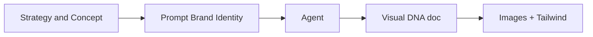

# Prompt — Brand Identity / Visual DNA (Meow Meow)

Prompt pour générer le **système d’identité visuelle** Meow Meow : palette HEX, typo, composants, art direction photo, brief logo. À utiliser après la stratégie et avant la génération d’images (Midjourney/DALL·E) et le calage Tailwind.

---

## Workflow

| Livrable attendu | Contenu |
|------------------|---------|
| Functional Palette Table | HEX → Backgrounds, UI, Typography. |
| Component Specs | Corner radius (2xl/3xl), shadows, borders. |
| Photography Art Direction | Lighting, composition, props (céramique, lin, bois). |
| Hero Logo Prompt | Description prompt-ready pour génération logo. |

---

## Bloc prompt (copier-coller)

<Context>
The strategic foundation for "Meow Meow" (Decor-Integrated Pet Nutrition) is locked. We now require a high-fidelity Visual Identity System (VIS) to orchestrate all creative assets and frontend styling. This system must bridge the gap between "Friendly/Kawaii" accessibility and "High-End/Japandi" sophistication.
</Context>

<Role>
Act as a Creative Director and Design Systems Architect specialized in "Contemporary Minimalist" aesthetics and Emotional UI/UX. You are an expert at defining "Quiet Luxury" tokens for lifestyle brands.
</Role>

<Action>
Generate a comprehensive "Visual DNA & Design System" blueprint. This document will serve as the algorithmic "Source of Truth" for AI image synthesis (Midjourney/DALL-E) and Tailwind CSS calibration.
</Action>

<Constraints>
- **Aesthetic Balance**: 70% Japandi-Minimalist (Clean, breathable, wood, ceramics) / 30% Kawaii-Pastel (Warmth, soft curves, approachable).
- **Format**: Systematic Markdown with tables for functional tokens.
- **Language**: Global English excellence.
</Constraints>

<Instructions>
Use the following Brand DNA inputs to architect the system:

1. **Brand Name**: Meow Meow.
2. **Core Palette**:
   - **Primary (The Soul)**: Creamy Latte (#FDFCF0) — Non-pure white, organic warmth.
   - **Secondary (The Blush)**: Soft Rose (#F8D7DA) — Delicate, refined, non-childish pink.
   - **Accent (The Contrast)**: Terracotta (#E07A5F) — Earthy, grounded, provides accessibility Contrast.
   - **Ink (The Legibility)**: Dark Roast (#2D2926) — Soft charcoal, avoids harsh pure black.
3. **Typography Strategy**:
   - **Heading**: Rounded Display (e.g., "M PLUS Rounded 1c") — Friendly but geometric.
   - **Body**: Clean Sans-Serif (e.g., "Inter") — Technical legibility and modernism.

**Target Deliverables:**
1. **Functional Palette Table**: Hex codes mapped to Backgrounds, UI Components (Buttons/Badges), and Typography.
2. **Component Specs**: Define Corner Radius (e.g., 2xl / 3xl), Shadow depth (Soft diffusion), and Border strategies (Ultra-fine).
3. **Photography Art Direction**: A definitive brief for AI generation including Lighting (Golden hour, diffuse), Composition (Rule of thirds, centered subjects), and Props (Matte ceramics, linen, light wood).
4. **The "Hero Logo" Prompt**: A clinical, prompt-ready description for a minimalist, typographic-driven logo.
2. **Typography Selection**: Recommend 1 Heading Font (Rounded/Display) and 1 Body Font (Clean Sans) available on Google Fonts (e.g., M PLUS Rounded 1c, Nunito, Quicksand, or Inter).
3. **Logo Brief**: Write a precise text description of the logo to be used as a prompt for Midjourney/DALL-E later.
4. **Art Direction**: Describe the photography style in 3 keywords and a short paragraph (e.g., lighting, props, mood) to guide future image generation.
</Instructions>