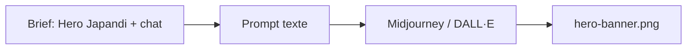

# Prompt — Hero Banner (Meow Meow)

Prompt de génération d’image pour la **bannière hero** de la landing Meow Meow : chat (British Shorthair) en interaction avec un bol céramique minimaliste, ambiance Japandi, golden hour. À utiliser dans Midjourney ou un outil compatible (DALL·E, etc.).

---

## Usage

| Étape | Action |
|-------|--------|
| 1 | Copier le bloc **Prompt (copier-coller)** dans Midjourney ou l’outil cible. |
| 2 | Ajuster `--ar` si le layout de la maquette impose un autre ratio. |
| 3 | Exporter l’image générée vers `docs/II. Graphic Collections/Assets/hero-banner.png` (ou équivalent). |

---

## Paramètres courants (Midjourney)

| Paramètre | Valeur utilisée | Description |
|-----------|-----------------|-------------|
| `--ar` | `16:9` | Ratio largeur:hauteur (hero full-width). |
| `--v` | `6.1` | Version du modèle Midjourney. |
| `--stylize` | `250` | Force du style (plus élevé = plus artistique). |

---

## Workflow



---

## Prompt (copier-coller)

```
Cinematic, low-angle wide shot of a fluffy British Shorthair cat interacting with a minimalist, matte ceramic bowl. **Setting**: High-end Japandi-style apartment, clean architectural lines, light oak floors, organic textures. **Lighting**: Soft morning diffusion, golden hour glow, airy atmosphere. **Camera**: Shot on 35mm lens, f/1.8, creamy bokeh, shallow depth of field. **Aesthetic**: #FDFCF0 Creamy Latte tones, breathing room, quiet luxury. --ar 16:9 --v 6.1 --stylize 250
```

---

## Intent stratégique

- **Hero** = première impression, renforce le positionnement "Aesthetic Pet Food" et "Decor-Integrated".
- Couleur **Creamy Latte (#FDFCF0)** rappelée dans le prompt pour cohérence avec la charte.
- Éviter fonds chargés ou packaging visible en priorité : le chat + le bol suffisent.
