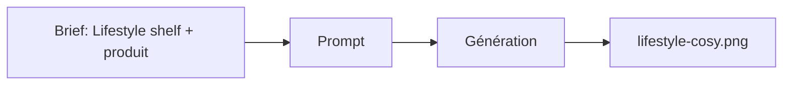

# Prompt — Lifestyle Cosy (Meow Meow)

Prompt de génération d’image **lifestyle** : sac de croquettes posé sur une étagère bois, déco scandinave, ambiance cosy. Utilisable pour sections "Why Us" ou galerie produit sur la landing.

---

## Usage

| Étape | Action |
|-------|--------|
| 1 | Copier le bloc **Prompt (copier-coller)** dans Midjourney ou l’outil cible. |
| 2 | Adapter `--ar` selon l’emplacement (ex. 4:5 pour colonne, 16:9 pour bandeau). |
| 3 | Exporter vers `docs/II. Graphic Collections/Assets/lifestyle-cosy.png`. |

---

## Paramètres (Midjourney)

| Paramètre | Valeur | Description |
|-----------|--------|-------------|
| `--ar` | `4:5` | Ratio vertical type feed / card. |
| `--v` | `6.1` | Version du modèle. |

---

## Workflow



---

## Prompt (copier-coller)

```
Interior design photography, a beautiful bag of cat food placed on a wooden shelf, scandinavian home decor, minimalist vase, beige walls, cozy atmosphere, soft natural light, pinterest aesthetic, blurry background --ar 4:5 --v 6.1
```

---

## Intent stratégique

- Montrer le produit **dans un intérieur** pour renforcer "Decor-Integrated" et "Shelf-Appeal".
- Ton cosy, pas clinique : lumière naturelle, fond flou, esthétique Pinterest.
