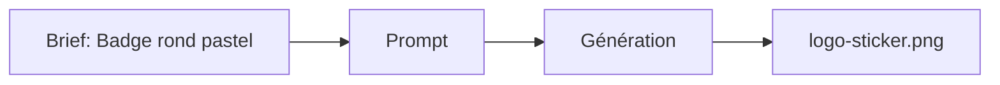

# Prompt — Logo Sticker / Badge (Meow Meow)

Prompt de génération d’un **badge / sticker** rond à l’effigie du chat Meow Meow : pastel Creamy Latte et Soft Rose, style kawaii minimal, bordure blanche. Pour favicon, badges UI ou goodies.

---

## Usage

| Étape | Action |
|-------|--------|
| 1 | Copier le bloc **Prompt (copier-coller)** dans Midjourney ou l’outil cible. |
| 2 | Format carré ou rond selon usage (favicon, sticker). |
| 3 | Exporter vers `logo-sticker.png`. |

---

## Paramètres (Midjourney)

| Paramètre | Valeur | Description |
|-----------|--------|-------------|
| `--v` | `6.1` | Version du modèle. |

---

## Workflow



---

## Prompt (copier-coller)

```
Kawaii Japanese style logo badge design, simplified round cat face icon with clean minimal features, big eyes, subtle kawaii aesthetic, pastel colors creamy latte and soft rose, geometric vector style, thick outlines, white border, professional logo badge format, scalable design, isolated on white background --v 6.1
```

---

## Intent stratégique

- Variante **badge** du logo pour usages secondaires (sticker, favicon, bouton).
- Cohérence palette Creamy Latte (#FDFCF0) et Soft Rose (#F8D7DA).
