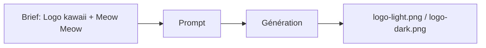

# Prompt — Logo (Meow Meow)

Prompt de génération du **logo principal** Meow Meow : icône chat kawaii géométrique, texte "Meow Meow", palette coffee brown et creamy beige, fond blanc. Pour usage navbar, footer, en-têtes.

---

## Usage

| Étape | Action |
|-------|--------|
| 1 | Copier le bloc **Prompt (copier-coller)** dans Midjourney ou l’outil cible. |
| 2 | Utiliser `--no shading` pour un rendu flat adapté au web. |
| 3 | Exporter en PNG haute résolution (ex. `logo-light.png` / `logo-dark.png` selon fond). |

---

## Paramètres (Midjourney)

| Paramètre | Valeur | Description |
|-----------|--------|-------------|
| `--no shading` | — | Design flat, vector-friendly. |
| `--v` | `6.1` | Version du modèle. |

---

## Workflow



---

## Prompt (copier-coller)

```
Minimalist kawaii Japanese style logo design, stylized cat head icon with clean geometric shapes, simplified features with big round eyes, subtle kawaii charm, thick bold black outlines, coffee brown and creamy beige color palette, text "Meow Meow" in modern rounded sans-serif font positioned next to icon, professional logo design, scalable vector format, isolated on white background, flat design, high quality, brand identity style --no shading --v 6.1
```

---

## Intent stratégique

- Équilibre **Kawaii + pro** : lisible en petit (navbar) et en grand (hero).
- Palette alignée avec Dark Roast et Creamy Latte de la charte.
