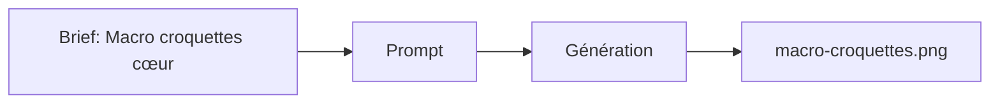

# Prompt — Macro Croquettes (Meow Meow)

Prompt de **macro-photo** des croquettes : forme cœur, texture organique, surface céramique terracotta, lumière latérale. Pour section produit ou zoom matière sur la landing.

---

## Usage

| Étape | Action |
|-------|--------|
| 1 | Copier le bloc **Prompt (copier-coller)** dans Midjourney ou l’outil cible. |
| 2 | `--stylize 200` pour un rendu détaillé sans sur-stylisation. |
| 3 | Exporter vers `macro-croquettes.png`. |

---

## Paramètres (Midjourney)

| Paramètre | Valeur | Description |
|-----------|--------|-------------|
| `--v` | `6.1` | Version du modèle. |
| `--stylize` | `200` | Détail et texture. |

---

## Workflow



---

## Prompt (copier-coller)

```
Extreme macro-photography of premium heart-shaped dry cat food kibbles. **Details**: Visible organic texture, subtle glaze, wholesome artisanal appearance. **Color**: Rich golden-brown gradients. **Composition**: Centered cluster on a matte terracotta ceramic surface. **Lighting**: Soft side-light highlighting the texture and shape. **Camera**: Shot on 100mm macro lens, f/2.8, sharp focus on the center kibble with progressive blur. --v 6.1 --stylize 200
```

---

## Intent stratégique

- Montrer la **qualité produit** (forme cœur, texture) sans packaging.
- Surface terracotta (#E07A5F) pour cohérence avec la charte.
