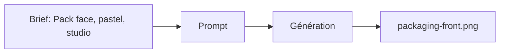

# Prompt — Packaging Front (Meow Meow)

Prompt de génération d’image **packaging face avant** : sac croquettes vue de face, design minimaliste pastel, rose et crème, fond blanc, studio. Pour galerie produit ou sections packaging.

---

## Usage

| Étape | Action |
|-------|--------|
| 1 | Copier le bloc **Prompt (copier-coller)** dans Midjourney ou l’outil cible. |
| 2 | Conserver `--no shadows` pour un rendu catalogue / e-commerce. |
| 3 | Exporter vers `docs/II. Graphic Collections/Assets/packaging-front.png`. |

---

## Paramètres (Midjourney)

| Paramètre | Valeur | Description |
|-----------|--------|-------------|
| `--ar` | `3:4` | Ratio portrait adapté au packaging. |
| `--v` | `6.1` | Version du modèle. |
| `--no shadows` | — | Réduire les ombres pour fond blanc propre. |

---

## Workflow



---

## Prompt (copier-coller)

```
Straight front view of a premium cat food bag, minimalist pastel design, matte texture, soft rose and cream colors, soft studio lighting, pure white background, 8k resolution --no shadows --ar 3:4 --v 6.1
```

---

## Intent stratégique

- **Face principale** du packaging pour reconnaissance de marque et cohérence avec Soft Rose (#F8D7DA) et Creamy Latte.
- Fond blanc et 8k pour usage web et print.
