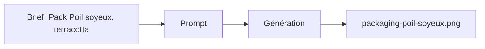

# Prompt — Packaging Poil Soyeux (Meow Meow)

Prompt de génération d’image **packaging** variante **Poil soyeux** : accent terracotta, icône sparkle, base cream et soft rose. Pour galerie des références produit.

---

## Usage

| Étape | Action |
|-------|--------|
| 1 | Copier le bloc **Prompt (copier-coller)** dans Midjourney ou l’outil cible. |
| 2 | Conserver le même ratio et style que les autres packagings (cohérence série). |
| 3 | Exporter vers `packaging-poil-soyeux.png`. |

---

## Paramètres (Midjourney)

| Paramètre | Valeur | Description |
|-----------|--------|-------------|
| `--ar` | `4:5` | Ratio portrait packaging. |
| `--v` | `6.1` | Version du modèle. |

---

## Workflow



---

## Prompt (copier-coller)

```
Product photography of a premium cat food packaging bag, matte pastel cream and soft rose color scheme, accent color is terracotta, sparkle icon, minimalist design, elegant typography, cute cat illustration on the label, high end pet food, soft studio lighting, isolated on white background, 8k resolution --ar 4:5 --v 6.1
```

---

## Intent stratégique

- **Variante gamme** : même base (cream, soft rose) avec accent **Terracotta** (#E07A5F) et icône sparkle pour la ligne "Poil soyeux".
