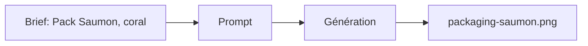

# Prompt — Packaging Saumon (Meow Meow)

Prompt de génération d’image **packaging** variante **Saumon** : accent soft coral, icône saumon, base cream et soft rose. Pour galerie des références produit.

---

## Usage

| Étape | Action |
|-------|--------|
| 1 | Copier le bloc **Prompt (copier-coller)** dans Midjourney ou l’outil cible. |
| 2 | Garder la même base pastel que les autres packagings (série cohérente). |
| 3 | Exporter vers `packaging-saumon.png`. |

---

## Paramètres (Midjourney)

| Paramètre | Valeur | Description |
|-----------|--------|-------------|
| `--ar` | `4:5` | Ratio portrait packaging. |
| `--v` | `6.1` | Version du modèle. |

---

## Workflow



---

## Prompt (copier-coller)

```
Product photography of a premium cat food packaging bag, matte pastel cream and soft rose color scheme, accent color is soft coral, salmon icon, minimalist design, elegant typography, cute cat illustration on the label, high end pet food, soft studio lighting, isolated on white background, 8k resolution --ar 4:5 --v 6.1
```

---

## Intent stratégique

- **Variante gamme** : accent **soft coral** et icône saumon pour la référence saveur / recette saumon.
