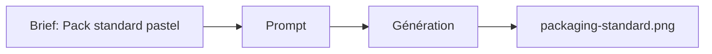

# Prompt — Packaging Standard (Meow Meow)

Prompt de génération d’image **packaging** **standard** (sans variante de couleur d’accent) : base cream et soft rose uniquement, design minimaliste, typo élégante, illustration chat. Référence générique pour la gamme.

---

## Usage

| Étape | Action |
|-------|--------|
| 1 | Copier le bloc **Prompt (copier-coller)** dans Midjourney ou l’outil cible. |
| 2 | Utiliser comme base de série avant les variantes (Saumon, Vitamines, Poil soyeux). |
| 3 | Exporter vers `packaging-standard.png` ou équivalent. |

---

## Paramètres (Midjourney)

| Paramètre | Valeur | Description |
|-----------|--------|-------------|
| `--ar` | `4:5` | Ratio portrait packaging. |
| `--v` | `6.1` | Version du modèle. |

---

## Workflow



---

## Prompt (copier-coller)

```
Product photography of a premium cat food packaging bag, matte pastel cream and soft rose color scheme, minimalist design, elegant typography, cute cat illustration on the label, high end pet food, soft studio lighting, isolated on white background, 8k resolution --ar 4:5 --v 6.1
```

---

## Intent stratégique

- **Référence neutre** de la gamme packaging : uniquement Creamy Latte et Soft Rose, sans accent couleur spécifique.
