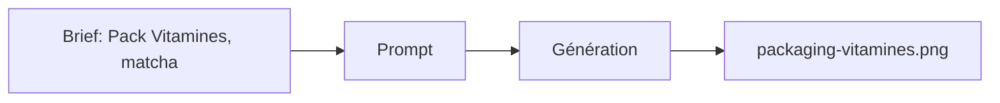

# Prompt — Packaging Vitamines (Meow Meow)

Prompt de génération d’image **packaging** variante **Vitamines** : accent matcha green, icône feuille, base cream et soft rose. Pour galerie des références produit.

---

## Usage

| Étape | Action |
|-------|--------|
| 1 | Copier le bloc **Prompt (copier-coller)** dans Midjourney ou l’outil cible. |
| 2 | Même base pastel que les autres packagings (cohérence de gamme). |
| 3 | Exporter vers `packaging-vitamines.png`. |

---

## Paramètres (Midjourney)

| Paramètre | Valeur | Description |
|-----------|--------|-------------|
| `--ar` | `4:5` | Ratio portrait packaging. |
| `--v` | `6.1` | Version du modèle. |

---

## Workflow



---

## Prompt (copier-coller)

```
Product photography of a premium cat food packaging bag, matte pastel cream and soft rose color scheme, accent color is matcha green, leaf icon, minimalist design, elegant typography, cute cat illustration on the label, high end pet food, soft studio lighting, isolated on white background, 8k resolution --ar 4:5 --v 6.1
```

---

## Intent stratégique

- **Variante gamme** : accent **matcha green** et icône feuille pour la ligne "Vitamines" / bien-être.
