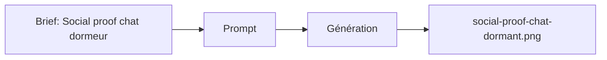

# Prompt — Social Proof Chat dormant (Meow Meow)

Prompt de génération **social proof** : chat qui dort sur un canapé beige, lumière naturelle, style smartphone authentique, format story. Pour section témoignages / communauté ou bannière secondaire.

---

## Usage

| Étape | Action |
|-------|--------|
| 1 | Copier le bloc **Prompt (copier-coller)** dans Midjourney ou l’outil cible. |
| 2 | `--ar 9:16` adapté au format story / mobile. |
| 3 | Exporter vers `social-proof-chat-dormant.png`. |

---

## Paramètres (Midjourney)

| Paramètre | Valeur | Description |
|-----------|--------|-------------|
| `--ar` | `9:16` | Format vertical type story. |
| `--v` | `6.1` | Version du modèle. |

---

## Workflow



---

## Prompt (copier-coller)

```
Authentic smartphone portrait photo of a cat sleeping peacefully on a cozy beige sofa, natural daylight from window, slightly grainy phone camera quality, real home environment, soft shadows, authentic moment captured, instagram story format, warm natural lighting, peaceful atmosphere, real life aesthetic --ar 9:16 --v 6.1
```

---

## Intent stratégique

- **Preuve sociale** : moment authentique, intérieur réel, pas de studio. Renforce la confiance et le côté "Aesthetic Cat Parent".
