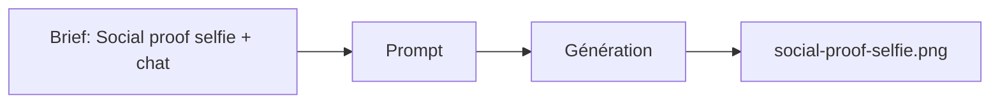

# Prompt — Social Proof Selfie (Meow Meow)

Prompt de génération **social proof** : selfie jeune femme avec chat, sourire authentique, intérieur, lumière naturelle, style smartphone type story. Pour section communauté / témoignages.

---

## Usage

| Étape | Action |
|-------|--------|
| 1 | Copier le bloc **Prompt (copier-coller)** dans Midjourney ou l’outil cible. |
| 2 | Format 9:16 pour usage story / colonne. |
| 3 | Exporter vers `social-proof-selfie.png`. |

---

## Paramètres (Midjourney)

| Paramètre | Valeur | Description |
|-----------|--------|-------------|
| `--ar` | `9:16` | Format vertical type story. |
| `--v` | `6.1` | Version du modèle. |

---

## Workflow



---

## Prompt (copier-coller)

```
Authentic smartphone selfie portrait, young woman in casual home clothes holding her cat close to face, genuine happy smile, natural indoor lighting from window, slightly grainy phone camera quality, real home environment visible in background, soft natural skin texture, cat looking at camera, authentic unposed moment, instagram story format, warm natural tones, slight motion blur, real life aesthetic --ar 9:16 --v 6.1
```

---

## Intent stratégique

- **Preuve sociale** : persona "Aesthetic Cat Parent" (jeune, intérieur soigné, moment spontané). Renforce l’identification et la confiance.
