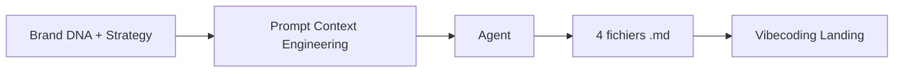

# Prompt — Context Engineering (Meow Meow)

Prompt maître pour générer le **package de documentation technique** Meow Meow (brand-dna, visual-design-system, content-assets, technical-manifesto). À injecter dans l’environnement de vibecoding pour aligner le code sur l’ADN de marque.

---

## Workflow

| Fichier attendu | Rôle |
|-----------------|------|
| **brand-dna.md** | Positionnement, persona, verbal identity, valeurs. |
| **visual-design-system.md** | HEX, typo, composants (radius, shadows). |
| **content-assets.md** | Navigation, hero copy, mapping images. |
| **technical-manifesto.md** | Stack (Vite, React, TS), architecture atomique, Tailwind + Framer Motion. |

---

## Bloc prompt (copier-coller)

<Context>
We are transitioning from the creative strategy phase to the technical orchestration of the "Meow Meow" landing page. To ensure absolute alignment between the AI coding agent (Vibecoding) and the Brand DNA, we need a high-density "Source of Truth" documentation package.
</Context>

<Role>
Act as a Senior Technical Lead and Context Engineer. Your expertise lies in "Instructional Scaffolding"—optimizing project context for Large Language Models to ensure zero-hallucination code generation.
</Role>

<Action>
Generate a comprehensive set of technical markdown files derived from the "Meow Meow" Brand DNA and Strategic Framework. These files must be ready to be "Injected" into an AI coding environment.
</Action>

<Constraints>
- **Target Project**: Meow Meow (Premium Cat Nutrition).
- **Scope**: Landing Page (Marketing centric).
- **Tech Stack**: React, Vite, Tailwind CSS, Framer Motion, Shadcn/UI.
- **Language**: 100% Technical English.
- **No DRYVIA References**: Ensure absolute removal of legacy "indoor shoe" context.
</Constraints>

<Instructions>
Synthesize the provided brand/strategy data into the following 4 foundational files:

1. **brand-dna.md**:
   - Executive positioning: "The Decor-Integrated Nutrition Pioneer".
   - Target Persona: "The Japandi Enthusiast Parent".
   - Verbal Identity: Core taglines and brand voice guidelines.
   - Values: Design-first, Pet Humanization, Quiet Luxury.

2. **visual-design-system.md**:
   - Color Tokens: Exact HEX codes (Creamy Latte, Soft Rose, Terracotta, Dark Roast) and their utility mapping.
   - Typography: Google Font pairings and scale (Montserrat/Inter).
   - Component Specs: Rounded corners (3xl), smooth transitions, diffused shadows.

3. **content-assets.md**:
   - Navigation Map: Home, Products, Why Us, Community.
   - Hero Copy: Standardized brand messaging.
   - Image Context: Mapping image purposes (Hero, Macro kibble, Social Proof) to their strategic intent.

4. **technical-manifesto.md**:
   - Tech Stack: Vite + React + TypeScript.
   - Architecture: Atomic component structure.
   - Styling: Tailwind CSS config requirements + Framer Motion for micro-interactions.
   - Rules: Responsive-first, high performance, zero visual clutter.
</Instructions>