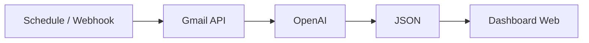
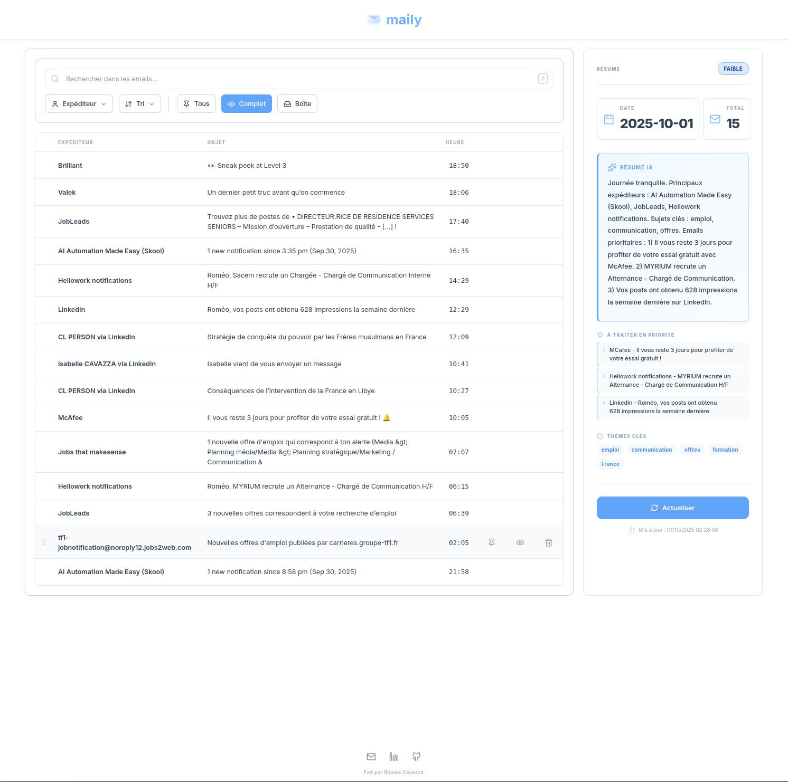

<p align="center">
  
</p>

<h1 align="center">Gmail AI Dashboard</h1>

<p align="center">
  
  
  
  
  
</p>

---

This workflow automatically fetches your Gmail messages, analyses them with OpenAI GPT-3.5, and displays results in a web interface. Gmail automation with AI analysis and modern web UI (sort, pin, archive, filters). One-command deploy with Docker.

```
gmail/
├── docker-compose.yml
├── json/workflow.json
├── assets/
└── frontend/
```

**Install (this workflow only)**

```bash
git clone --filter=blob:none --sparse https://github.com/RomeoCavazza/no-low-code.git
cd no-low-code && git sparse-checkout set gmail && cd gmail
```

| Layer | Implementation |
|-------|----------------|
| **Orchestration** | n8n |
| **AI** | OpenAI GPT-3.5 |
| **Data** | Gmail API |
| **Interface** | Vanilla JS, HTML5, CSS3, localStorage |
| **Runtime** | Docker + docker-compose |



---

## Workflow

n8n pipeline: trigger (schedule 6pm, webhook `/webhook/refresh-mails`, or manual), fetch messages from Gmail API (24h window), extract and clean data, run OpenAI analysis, write `mails-today.json` to frontend data folder.


*Services and features: Schedule and webhook triggers, Gmail API fetch, OpenAI GPT-3.5 for summaries and urgency detection, JSON output for the dashboard.*

## Frontend

Web dashboard consuming the generated JSON: daily AI summary with urgency badge, email list with actions (pin, archive, delete, restore), real-time search (`/`), filters by sender and pinned. Stack: HTML5, CSS3, Vanilla JavaScript, localStorage, Lucide icons.



*Interface features: AI summary card, urgency badge, sort and filters, pin/archive/delete/restore, empty states.*

---

## Quick start

### Prerequisites

| Tool | Description |
|------|-------------|
| Docker | Engine + Compose |
| Google account | Gmail enabled |
| OpenAI API | Credits available |

### Step 1: Prepare permissions

```bash
docker run --rm -v "$(pwd)/frontend/data:/data" alpine sh -c "chmod -R 777 /data"
```

### Step 2: Start services

```bash
docker-compose up -d
# Wait ~30 seconds for init
```

### Step 3: Import the workflow

1. Open **http://localhost:5678**
2. Menu → **Import from File** → `json/workflow.json`

### Step 4: Configure credentials

**Gmail OAuth2**

1. [Google Cloud Console](https://console.cloud.google.com/) → Create a project
2. Enable **Gmail API**
3. Create **OAuth 2.0 Client ID** (type: Web application)
4. Set Authorized origins: `http://localhost:5678`, Redirect URI: `http://localhost:5678/rest/oauth2-credential/callback`
5. In n8n: "Get many messages" node → Create credential → Connect

**OpenAI**

1. Create an API key at [platform.openai.com](https://platform.openai.com/api-keys)
2. In n8n: "Basic LLM Chain" node → Create credential → Paste key

### Step 5: Test and activate

```bash
# In n8n: "Test workflow" button
cat frontend/data/mails-today.json

# Activate workflow: Toggle "Active" → ON
curl -X POST http://localhost:5678/webhook/refresh-mails
```

### Endpoints

| Service | URL |
|---------|-----|
| Web interface | http://localhost:8080 |
| n8n | http://localhost:5678 |
| Generated JSON | http://localhost:8080/data/mails-today.json |

### Troubleshooting

| Issue | Solution |
|-------|----------|
| OAuth error | Check redirect URIs in Google Console |
| Empty JSON | Run the workflow manually in n8n |
| Port in use | Change ports in `docker-compose.yml` |
| Interface debug | `console.log(window.state)`; `localStorage.clear()` to reset |
