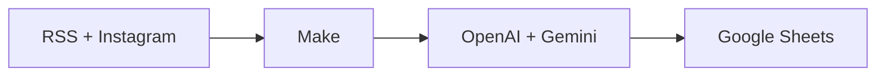
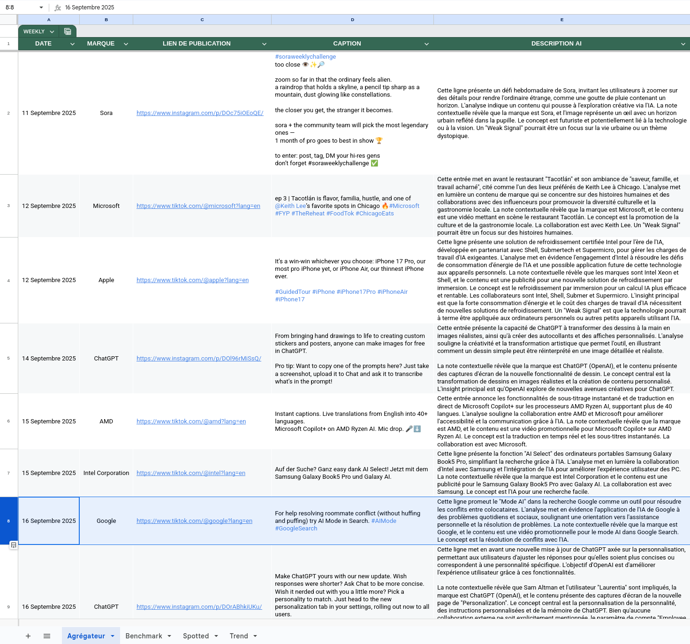

<p align="center">
  
</p>

<h1 align="center">Multi-Scraper IA</h1>

<p align="center">
  
  
  
  
  
</p>

---

Make workflow for multi-source AI monitoring: RSS feeds + Instagram tech accounts → Google Sheets with automatic AI enrichment. Aggregate, deduplicate, and enrich with GPT and Gemini then export to a spreadsheet.

```
multi-scraper/
├── json/workflow.json
└── assets/
```

**Install (this workflow only)**

```bash
git clone --filter=blob:none --sparse https://github.com/RomeoCavazza/no-low-code.git
cd no-low-code && git sparse-checkout set multi-scraper && cd multi-scraper
```

| Layer | Implementation |
|-------|----------------|
| **Orchestration** | Make |
| **Sources** | RSS, Apify (Instagram) |
| **AI** | OpenAI GPT-3.5, Google Gemini (images) |
| **Storage** | Google Sheets |
| **Runtime** | Make cloud |



---

## Workflow

Make scenario: aggregate RSS feeds (e.g. NVIDIA, OpenAI, Google, Microsoft) and Instagram tech accounts via Apify, enrich each item with GPT-3.5 summaries and Gemini Pro image analysis, deduplicate, then append rows to Google Sheets.


*Services and features: RSS and Instagram aggregation, OpenAI + Gemini enrichment, deduplication, Google Sheets export (Title, URL, Date, Source, AI Summary).*

## Data (Google Sheets)

Google Sheet stores the enriched feed: Title, URL, Date, Source, AI Summary. Run the scenario once or on a schedule (e.g. every 6h). Demo: [Google Sheet](https://docs.google.com/spreadsheets/d/17JXOTxNk7-EDYpSQIKgBH-hyClpwn7jkmSknl3Azs1A/edit).



*Sheet columns: Title, URL, Date, Source, AI Summary. Features: RSS + Instagram sources, GPT and Gemini enrichment, automatic deduplication.*

---

## Quick start

### Prerequisites

| Service | Description |
|---------|-------------|
| Make | Free or paid account |
| Google Sheets | Google account |
| OpenAI API | Credits available |
| Gemini API | Google AI Studio |
| Apify | For Instagram scraping |

### Step 1: Create the Google Sheet

1. Create a new Google Sheet
2. Add columns: `Title | URL | Date | Source | AI Summary`
3. Copy the spreadsheet ID from the URL

### Step 2: Import the workflow

1. Open [Make.com](https://make.com)
2. Scenarios → **Create a new scenario**
3. Menu (⋮) → **Import Blueprint**
4. Select `json/workflow.json`

### Step 3: Configure credentials

| Service | Configuration |
|---------|---------------|
| Google Sheets | Connect Google account + spreadsheet ID |
| OpenAI | API key from platform.openai.com |
| Gemini | API key from Google AI Studio |
| Apify | Token from apify.com/account |

### Step 4: Configure sources and run

1. **RSS** : Edit feed URLs in the RSS module
2. **Instagram** : Edit the list of accounts to scrape
3. Click "Run once" to test, then enable scheduling (e.g. every 6h)

### Troubleshooting

| Issue | Solution |
|-------|----------|
| API limits | Check OpenAI/Gemini quotas |
| Rate limiting | Reduce run frequency |
| Permissions | Check Google Sheets access |
| Instagram blocked | Check Apify token and quotas |
