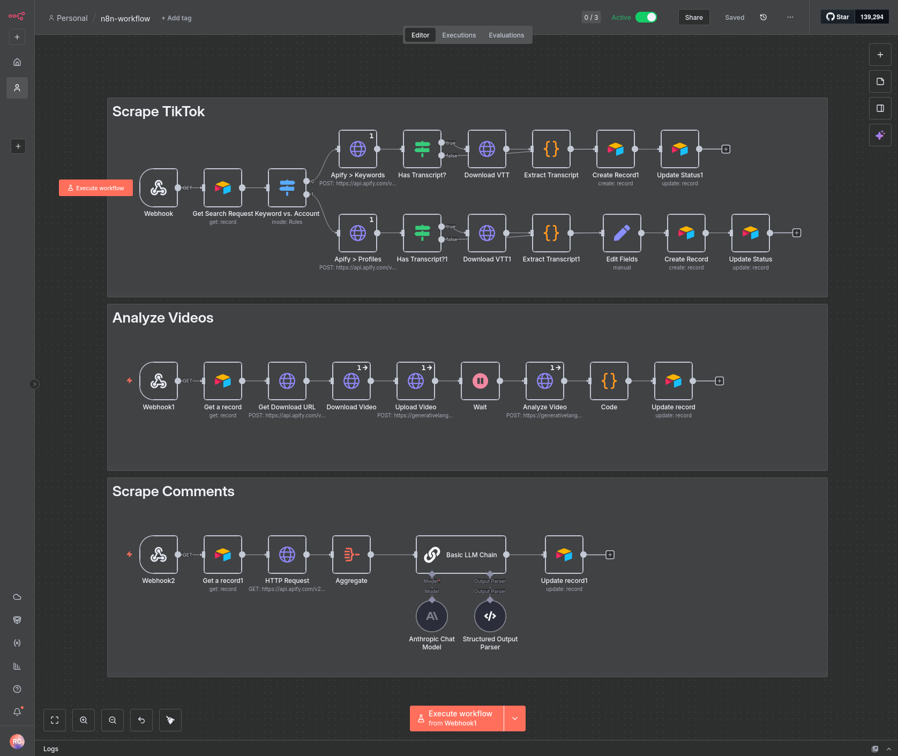
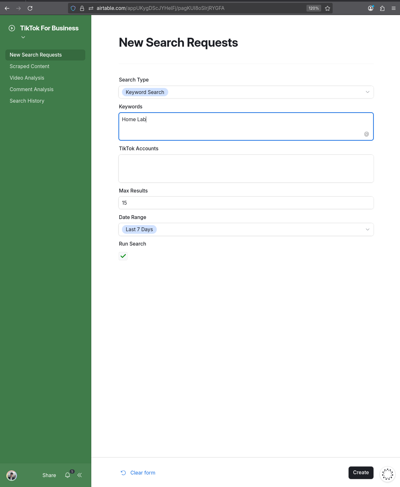
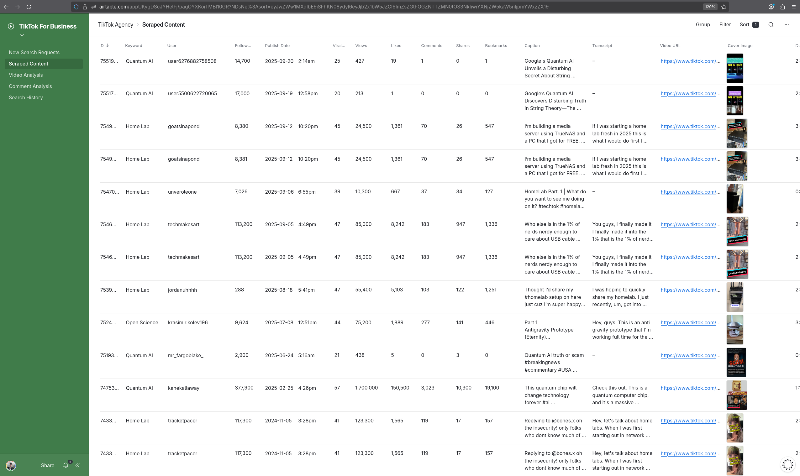

<p align="center">
  
</p>

<h1 align="center">TikTok Intelligence</h1>

<p align="center">
  
  
  
  
  
</p>

---

n8n workflow for TikTok monitoring: extract videos by keywords or accounts, fetch VTT transcripts, and store enriched data in Airtable. Automated extraction, transcripts and AI analysis for creator or trend monitoring.

```
tiktok/
├── json/workflow.json
└── assets/
```

**Install (this workflow only)**

```bash
git clone --filter=blob:none --sparse https://github.com/RomeoCavazza/no-low-code.git
cd no-low-code && git sparse-checkout set tiktok && cd tiktok
```

| Layer | Implementation |
|-------|----------------|
| **Orchestration** | n8n |
| **Source** | Apify (TikTok Scraper) |
| **AI** | OpenAI (summaries, insights) |
| **Storage** | Airtable |
| **Input** | Webhook / web form |


---

## Workflow

n8n scenario: webhook/form receives search params (keywords or accounts, period, number of results), calls Apify TikTok Scraper, extracts VTT subtitles, runs OpenAI for summaries and insights, writes rows to Airtable.



*Services and features: Webhook trigger, Apify TikTok Scraper, VTT extraction, OpenAI summaries and insights, Airtable integration.*



*Web form to trigger a search: keywords, accounts, period, number of results.*

## Data (Airtable)

Airtable base stores scraped content: video URL, author, description, views, likes, comments, shares, transcript, AI summary, created at. Use the web form to run searches and inspect results in the table.



*Table columns: Video URL, Author, Description, Views, Likes, Comments, Shares, Transcript, AI Summary, Created At. Form parameters: Keywords, Accounts, Period, Results.*

---

## Quick start

### Prerequisites

| Service | Description |
|---------|-------------|
| n8n | Cloud or self-hosted |
| Apify | Account with TikTok Scraper |
| Airtable | Base |
| OpenAI API | Credits available |

### Step 1: Set up Airtable

1. Create a new **Base** at [airtable.com](https://airtable.com)
2. Create a table **"Scraped Content"** with columns: Video URL (URL), Author (Single line text), Description (Long text), Views, Likes, Comments, Shares (Number), Transcript, AI Summary (Long text), Created At (Date)
3. Copy the **Base ID** from the URL (`airtable.com/appXXXXXXX/...`)

### Step 2: Import the workflow

1. Open your **n8n** instance
2. Workflows → **Import from File**
3. Select `json/workflow.json`

### Step 3: Configure credentials

| Service | Configuration |
|---------|---------------|
| Apify | Token from apify.com/account |
| Airtable | API key + Base ID + Table name |
| OpenAI | API key from platform.openai.com |

### Step 4: Activate and use

1. Activate the workflow (toggle **Active** → ON)
2. Copy the webhook URL (first node)
3. Open the form via that URL and run a search

### Form parameters

| Field | Description | Example |
|-------|-------------|---------|
| Keywords | Search keywords | `AI tools, productivity` |
| Accounts | Specific accounts | `@openai, @nvidia` |
| Period | Search period (days) | `7` |
| Results | Number of results | `20` |

### Troubleshooting

| Issue | Solution |
|-------|----------|
| 401/403 | Check Apify/Airtable credentials |
| Missing VTT | Some videos have no subtitles |
| Rate limiting | Lower `resultsPerPage` |
| Timeout | Increase timeout in n8n |
