<div align="center">

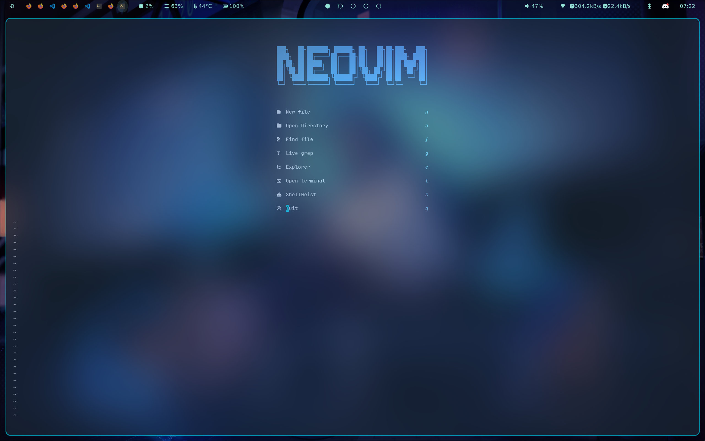

<p>
    <a>
      
    </a>
    <a>
      
    </a>
    <a href="https://github.com/neovim/neovim/releases/tag/stable">
      
    </a>
    <a>
      
    </a>
    <a>
      
    </a>
    <a>
      
    </a>
</p>
</div>

# Introduction

This repo hosts my personal Neovim configuration for Linux (NixOS).
`init.lua` is the config entry point.

**This config is only maintained for [the latest nvim stable release](https://github.com/neovim/neovim/releases/tag/stable).**

# Structure

```
~/.config/nvim/
├── init.lua                 # Entry point
├── lazy-lock.json           # Plugin lockfile
├── assets/                  # Screenshots
└── lua/
    ├── core/                # Base configuration
    │   ├── bootstrap.lua    # lazy.nvim bootstrap
    │   ├── options.lua      # Vim options
    │   ├── keymaps.lua      # Keybindings
    │   ├── autocmds.lua     # Autocommands
    │   ├── theme.lua        # Transparency and colors
    │   ├── status.lua       # Statusline components
    │   ├── popup.lua        # Right-click menu
    │   ├── force_floats.lua # Float window transparency
    │   ├── ibl.lua          # Indent guides config
    │   └── click_copy.lua   # Click-to-copy for notifications
    ├── plugins/             # Plugin specifications
    │   ├── init.lua         # Plugin loader
    │   ├── pretty.lua       # Theme, statusline, UI
    │   ├── lsp.lua          # LSP and completion
    │   ├── ai.lua           # Avante and CodeCompanion
    │   ├── nav.lua          # Telescope and NvimTree
    │   ├── layout.lua       # Terminal, Trouble, Edgy
    │   ├── git.lua          # Fugitive
    │   ├── dashboard.lua    # Alpha dashboard
    │   └── shellgeist.lua   # ShellGeist plugin
    └── user/                # Personal overrides
        ├── local.lua        # Machine-specific secrets
        └── shellgeist.lua   # ShellGeist configuration
```

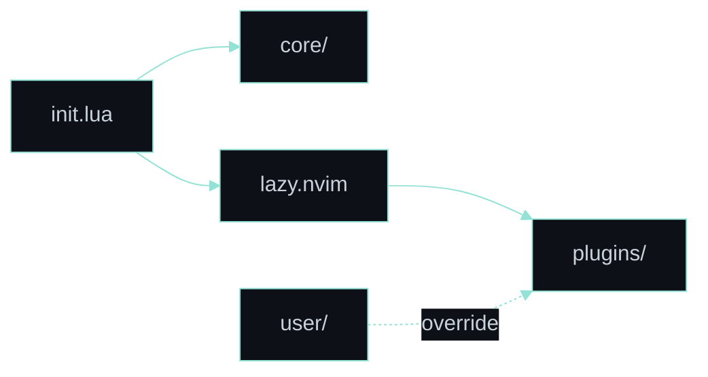

# Visual Guide

## Keybinds

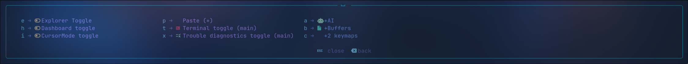

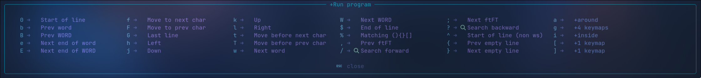

## Dashboard Entries

| Entry | Preview |
|-------|---------|
| **New File** | 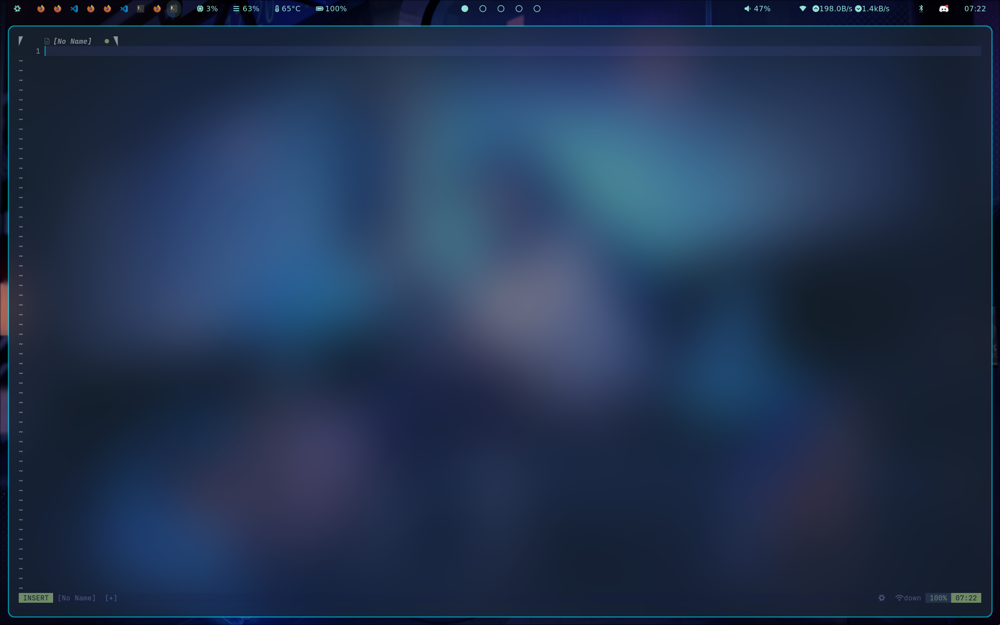 |
| **Open Directory** | 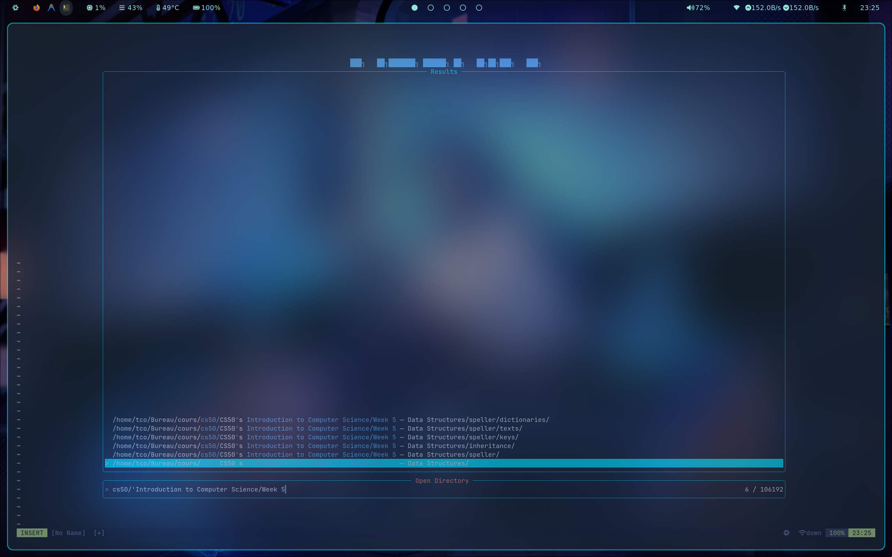 |
| **Find File** | 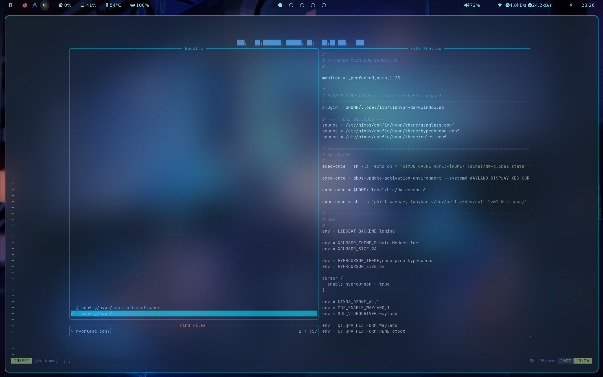 |
| **Live Grep** | 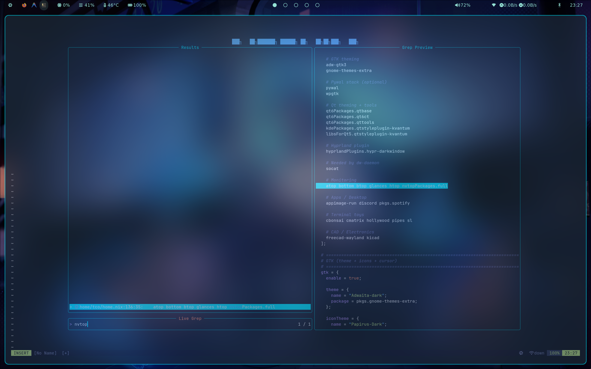 |
| **Explorer** | 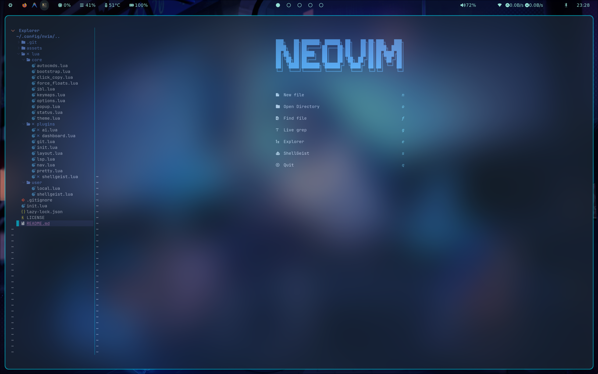 |
| **Open Terminal** | 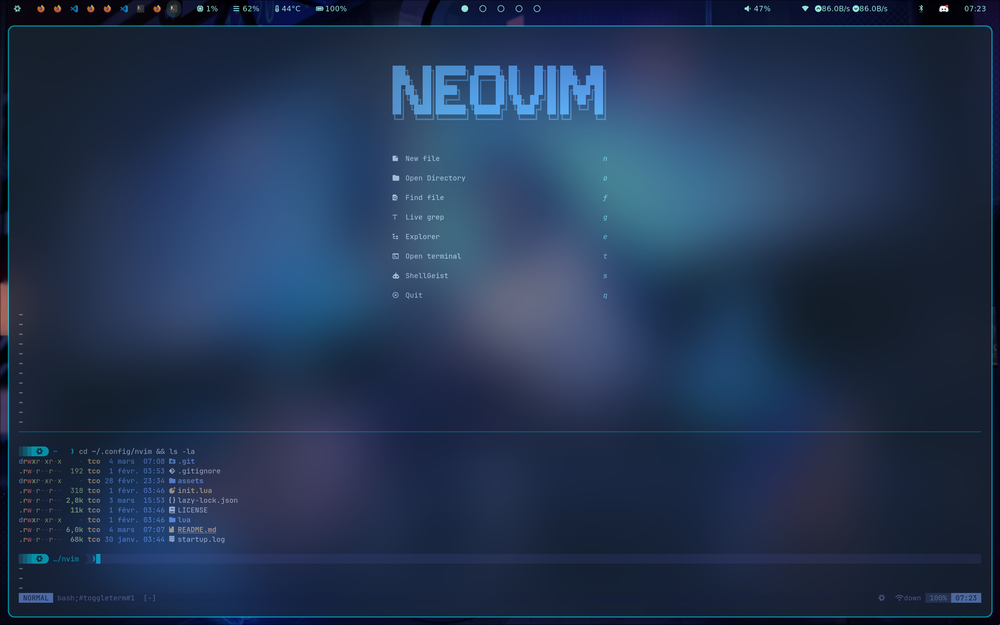 |
| **ShellGeist** |  |

# Features

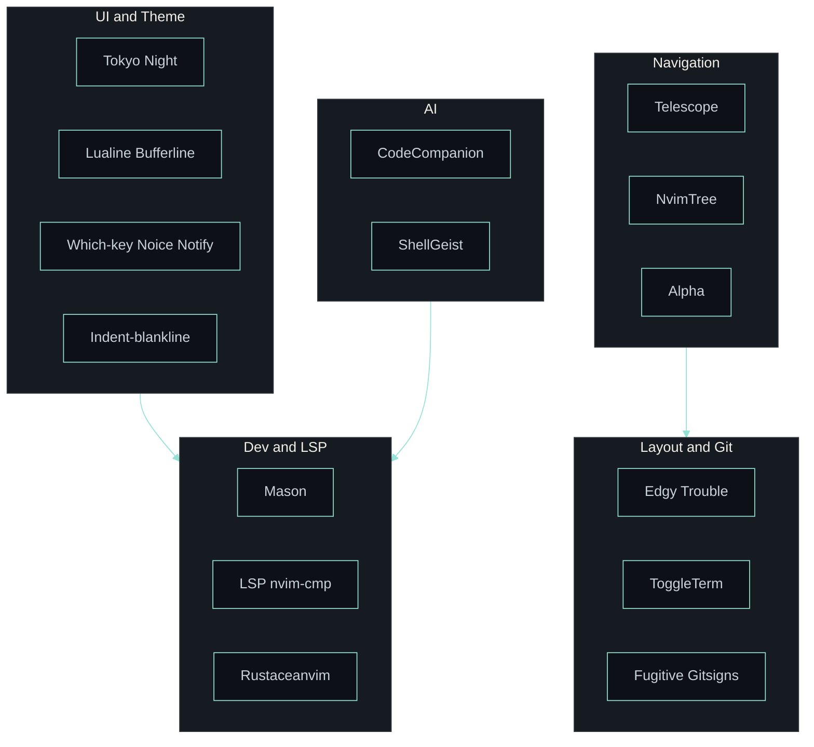

+ Plugin management via [lazy.nvim](https://github.com/folke/lazy.nvim).
+ Code and snippet auto-completion via [nvim-cmp](https://github.com/hrsh7th/nvim-cmp).
+ Language server protocol (LSP) support via [nvim-lspconfig](https://github.com/neovim/nvim-lspconfig).
+ LSP server management via [mason.nvim](https://github.com/williamboman/mason.nvim).
+ Git integration via [vim-fugitive](https://github.com/tpope/vim-fugitive) and [gitsigns.nvim](https://github.com/lewis6991/gitsigns.nvim).
+ Fuzzy finding via [telescope.nvim](https://github.com/nvim-telescope/telescope.nvim).
+ Beautiful statusline via [lualine.nvim](https://github.com/nvim-lualine/lualine.nvim) with network ping indicator.
+ Buffer tabs via [bufferline.nvim](https://github.com/akinsho/bufferline.nvim).
+ File tree explorer via [nvim-tree.lua](https://github.com/nvim-tree/nvim-tree.lua).
+ User-defined mapping hints via [which-key.nvim](https://github.com/folke/which-key.nvim).
+ Code highlighting via [nvim-treesitter](https://github.com/nvim-treesitter/nvim-treesitter).
+ Beautiful colorscheme via [tokyonight.nvim](https://github.com/folke/tokyonight.nvim) (transparent mode).
+ Modern command UI via [noice.nvim](https://github.com/folke/noice.nvim).
+ Animated notifications via [nvim-notify](https://github.com/rcarriga/nvim-notify).
+ Diagnostics panel via [trouble.nvim](https://github.com/folke/trouble.nvim).
+ Terminal integration via [toggleterm.nvim](https://github.com/akinsho/toggleterm.nvim).
+ Cursor-like window layout via [edgy.nvim](https://github.com/folke/edgy.nvim).
+ Indent guides via [indent-blankline.nvim](https://github.com/lukas-reineke/indent-blankline.nvim).
+ Dashboard via [alpha-nvim](https://github.com/goolord/alpha-nvim).
+ Rust development via [rustaceanvim](https://github.com/mrcjkb/rustaceanvim).
+ AI sidebar assistant via [avante.nvim](https://github.com/yetone/avante.nvim).
+ AI chat and actions via [codecompanion.nvim](https://github.com/olimorris/codecompanion.nvim).
+ Custom AI code editing via [ShellGeist](https://github.com/RomeoCavazza/shellgeist).

# Installation

## Prerequisites

- Neovim 0.10+
- Git
- A Nerd Font (for icons)
- Ollama (for local AI)
- Optional: `fd`, `ripgrep` for Telescope

## Setup

```bash
# Backup existing config
mv ~/.config/nvim ~/.config/nvim.bak

# Clone this config
git clone https://github.com/YOUR_USERNAME/nvim-config ~/.config/nvim

# Start Neovim (plugins will auto-install)
nvim
```

## Ollama Setup

```bash
# Install Ollama
curl -fsSL https://ollama.ai/install.sh | sh

# Pull recommended models
ollama pull deepseek-coder-v2:16b-lite-instruct-q4_K_M
ollama pull deepseek-r1:14b
```
